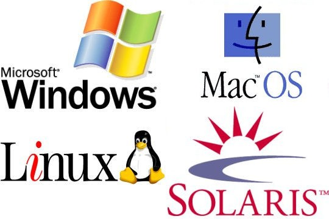

**Операцио́нная систе́ма**, сокр. ОС — комплекс взаимосвязанных программ, предназначенных для управления ресурсами компьютера и организации взаимодействия с пользователем.  
Предшественником операционных систем следует считать служебные программы (загрузчики и мониторы), а также библиотеки часто используемых подпрограмм, начавшие разрабатываться с появлением универсальных компьютеров 1-го поколения (конец 1940-х годов). Служебные программы минимизировали физические манипуляции оператора с оборудованием, а библиотеки позволяли избежать многократного программирования одних и тех же действий (осуществления операций ввода-вывода, вычисления математических функций и т. п.).

В 1950—1960-х годах сформировались и были реализованы основные идеи, определяющие функциональность ОС: пакетный режим, разделение времени и многозадачность, разделение полномочий, реальный масштаб времени, файловые структуры и файловые системы.

Основные функции:

* Исполнение запросов программ (ввод и вывод данных, запуск и остановка других программ, выделение и освобождение дополнительной памяти и др.).
* Загрузка программ в оперативную память и их выполнение.
* Стандартизованный доступ к периферийным устройствам (устройства ввода-вывода).
* Управление оперативной памятью (распределение между процессами, организация виртуальной памяти).
* Управление доступом к данным на энергонезависимых носителях (таких как жёсткий диск, оптические диски и др.), организованным в той или иной файловой системе.
* Обеспечение пользовательского интерфейса.
* Сохранение информации об ошибках системы.

Дополнительные функции:

* Параллельное или псевдопараллельное выполнение задач (многозадачность).
* Эффективное распределение ресурсов вычислительной системы между процессами.
* Разграничение доступа различных процессов к ресурсам.
* Организация надёжных вычислений (невозможности одного вычислительного процесса намеренно или по ошибке повлиять на вычисления в другом процессе), основана на разграничении доступа к ресурсам.
* Взаимодействие между процессами: обмен данными, взаимная синхронизация.
* Защита самой системы, а также пользовательских данных и программ от действий пользователей (злонамеренных или по незнанию) или приложений.
* Многопользовательский режим работы и разграничение прав доступа (см.: аутентификация, авторизация).
