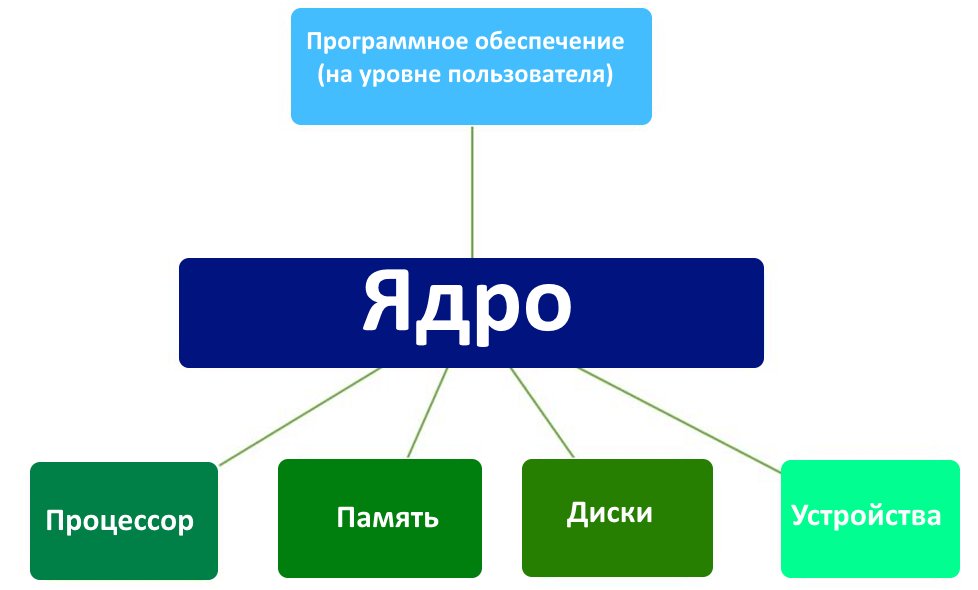

Основа, сердце и мозг любой операционной системы — это ее ядро. Его архитектура определяет принципы взаимодействия приложений с аппаратными ресурсами компьютера и периферийными устройствами.

Актуальные версии ОС Microsoft (7, 8.1 и 10) построены на гибридном ядре NT. Оно имеет модульную структуру и включается в себя микроядро, уровень аппаратных абстракций, драйверы и службы, работающие в режиме kernel-mode. Ядро работает в защищенной области и имеет полный доступ к системным и аппаратным ресурсам. Пользовательский режим состоит из двух подсистем: внутренней (интегральной) и внешней (подсистема окружения). Первая контролирует такие аспекты работы ОС, как авторизация, доступ к учетной записи, подключение к сети, использование сетевых сервисов и протоколов. Подсистема окружения отвечает за запуск программного обеспечения и графический интерфейс. Для операций пользовательского режима непосредственное обращение к аппаратной части исключается. Любой программный запрос предварительно обрабатывается ядром и передается дальше уже от его имени.  
В семействе операционных систем Linux используется монолитное ядро с динамически подключаемыми модулями. В нем собраны все базовые сервисы – драйверы устройств, сетевые протоколы, управление дисковыми пространствами и файловой системой. Динамический механизм подключения позволяет вводить их в работу по мере необходимости, к примеру, при обнаружении нового устройства или по желанию пользователя. Добавление и удаление компонентов выполняется без остановки системы. Главным достоинством монолитного ядра считается скорость работы.  
В последние годы наблюдается картина взаимной интеграции ОС на уровне ядер. Microsoft осуществляет поддержку виртуализации, разместив дистрибутивы Ubuntu, openSUSE и Debian в магазине MS Store, а в 2020 году обещает внедрить ядро Linux в дистрибутив Windows 10. С другой стороны, свободное сообщество реализовало KVM (kernel-based virtual machine). С помощью этой виртуальной машины Linux может запускать Windows поверх своего ядра.

