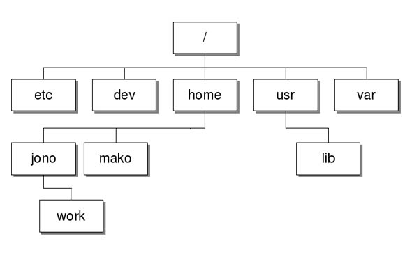

Linux предоставляет файловую систему более реально, такой как она есть на самом деле. Начинается структура файловой системы с корня, или, другими словами, основного каталога системного раздела, а уже туда подключаются все другие диски по нужных подкаталогах.

Файлы сортируются по каталогам в зависимости от типа, например, исполняемые - в **/bin/**, настройки - **/etc/**, а ресурсы - в **/usr/**. Получается что одна программа разделена по всей файловой системе, но это не выведывает трудностей из-за пакетного менеджера.

  
Устройства хранения в Linux именуются по алфавиту, а разделы на них - цифрами. Например, первый жесткий диск будет иметь имя sda, второй - sdb. А разделы на первом будут нумероваться - sda1, sda2, sda3 и так далее. Разделы могут свободно монтироваться в любую нужную папку, например, в качестве домашнего каталога или /var/.

Windows создает дополнительную абстракцию. Хотя диски и разделы именуются похожим образом, как и в Linux, но все это скрыто операционной системой. Пользователю же предоставляется такая абстракция, как диск C:, D:, E:, F: и так далее. Каждый из них - это раздел на жестком диске, а более подробную информацию от пользователя система скрывает. Это и к лучшему для новичков. Что касается распределения файлов, то одна программа находится в одной папке, со всеми исполняемыми файлами, настройками и ресурсами.  
Каждый дистрибутив Linux позволяет использовать одну из этих файловых систем, каждая из них имеет свои преимущества и недостатки. Все они включены в ядро и могут использоваться в качестве корневой файловой системы. Давайте рассмотрим каждую из них более подробно.

Ext2, Ext3, Ext4 или Extended Filesystem - это стандартная файловая система для Linux. Она была разработана еще для Minix. Она самая стабильная из всех существующих, кодовая база изменяется очень редко и эта файловая система содержит больше всего функций. Версия ext2 была разработана уже именно для Linux и получила много улучшений. В 2001 году вышла ext3, которая добавила еще больше стабильности благодаря использованию журналирования. В 2006 была выпущена версия ext4, которая используется во всех дистрибутивах Linux до сегодняшнего дня. В ней было внесено много улучшений, в том числе увеличен максимальный размер раздела до одного экзабайта.  
JFS или Journaled File System была разработана в IBM для AIX UNIX и использовалась в качестве альтернативы для файловых систем ext. Сейчас она используется там, где необходима высокая стабильность и минимальное потребление ресурсов. При разработке файловой системы ставилась цель создать максимально эффективную файловую систему для многопроцессорных компьютеров. Также как и ext, это журналируемая файловая система, но в журнале хранятся только метаданные, что может привести к использованию старых версий файлов после сбоев.  
ReiserFS - была разработана намного позже, в качестве альтернативы ext3 с улучшенной производительностью и расширенными возможностями. Она была разработана под руководством Ганса Райзера и поддерживает только Linux. Из особенностей можно отметить динамический размер блока, что позволяет упаковывать несколько небольших файлов в один блок, что предотвращает фрагментацию и улучшает работу с небольшими файлами. Еще одно преимущество - в возможности изменять размеры разделов на лету. Но минус в некоторой нестабильности и риске потери данных при отключении энергии  
XFS - это высокопроизводительная файловая система, разработанная в Silicon Graphics для собственной операционной системы еще в 2001 году. Она изначально была рассчитана на файлы большого размера, и поддерживала диски до 2 Терабайт. Из преимуществ файловой системы можно отметить высокую скорость работы с большими файлами, отложенное выделение места, увеличение разделов на лету и незначительный размер служебной информации.  
XFS - журналируемая файловая система, однако в отличие от ext, в журнал записываются только изменения метаданных. Она используется по умолчанию в дистрибутивах на основе Red Hat. Из недостатков - это невозможность уменьшения размера, сложность восстановления данных и риск потери файлов при записи, если будет неожиданное отключение питания, поскольку большинство данных находится в памяти.

