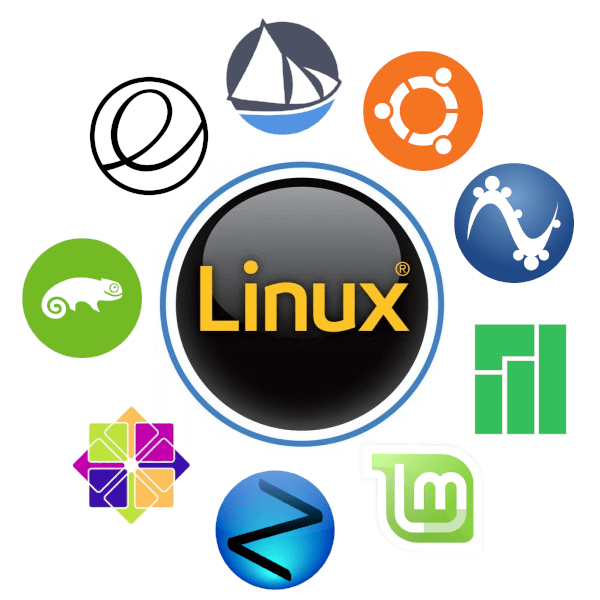

В то время как Windows сохранила вполне стандартную структуру версий, с минорными и мажорными обновлениями, в Linux же всё обстоит гораздо сложнее.

На сегодняшний день ядро Linux лежит в основе всех операционных систем на базе Linux. Однако, поскольку его исходные коды остаются открытыми, любой человек может настроить или изменить ОС для своих собственных целей. В результате мы имеем сотни индивидуальных Linux-подобных операционных систем, называемых дистрибутивами. Это делает невероятно трудным выбор между ними, гораздо более сложным, чем просто выбор между Windows 7, Windows 8 или Windows 10.

Но у такого расклада есть и свои достоинства. Учитывая природу программного обеспечения с открытым исходным кодом, эти дистрибутивы могут сильно отличаться по функциональности и сложности, ведь каждый дистрибутив Linux имеет свой цикл разработки, и многие из них постоянно развиваются.

Для тех из вас, кто является новичком в Linux, в качестве отправной точки рекомендуется начать с дистрибутива под названием Ubuntu. Он чрезвычайно удобен в использовании (даже по сравнению с Windows), но при этом также достаточно универсален и многофункционален, чтобы удовлетворить, в том числе, и опытных технарей. Мы уже ранее проводили обзор дистрибутивов Linux, где вы сможете изучить и другие доступные варианты.

В случае с Windows существует только одна компания — Microsoft, которая занимается разработкой и обслуживанием всей операционной системы: ядро, среда рабочего стола и большая часть предустановленного программного обеспечения. Вы должны принимать всё, что они вам предлагают, независимо от того, будет это вам полезно или нет.

