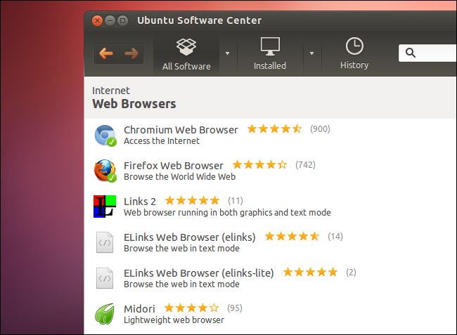
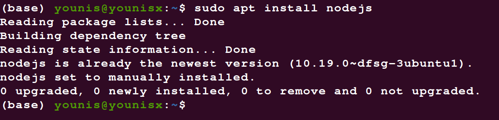

Продолжим сравнение Windows и Linux. Управление программами и их обновлением это огромная разница Windows и Linux, настолько все реализовано по-другому.

В Linux существуют репозитории пакетов программ. Там есть если не все, то почти все необходимые программы, драйвера и компоненты системы. У вас почти не будет необходимости качать программы из интернета, хотя такая возможность тоже есть

.

Использование централизованных репозиториев дает большую безопасность и надежность, а также возможность обновления. Как только новая версия программы появилась в репозитории, вы можете ее обновить. Процесс обновления выполняется одной командой сразу для всей системы, тогда, когда вам это удобно.

В Windows нет репозиториев, вам придется искать все необходимые программы в интернете и устанавливать их вручную. Каждая программа будет обновляться сама, когда будет считать нужным, в том числе и система. Для обновления системы понадобиться перезагрузка, причем в вопросе установки обновлений Windows бывает очень настойчивой.

