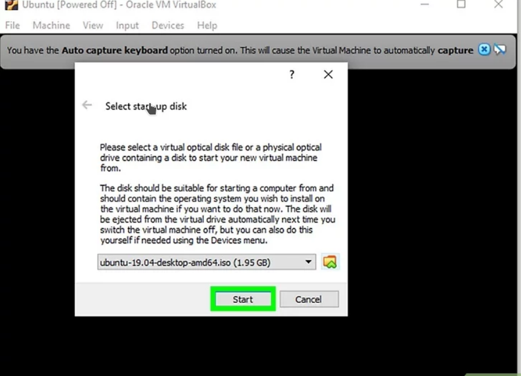
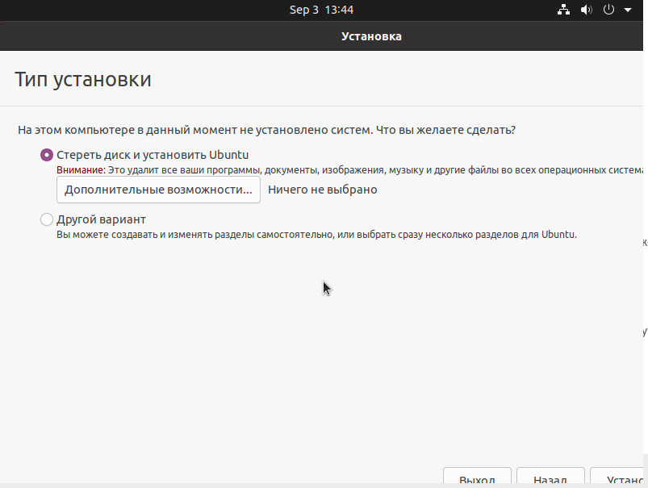
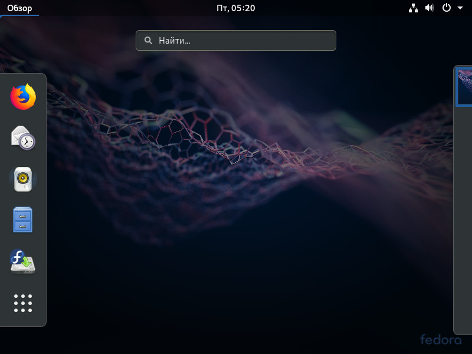

**Как скачать Ubuntu**

**Откройте веб-сайт Ubuntu.**Перейдите на страницу [**https://www.ubuntu.com/download/desktop**]("https://www.ubuntu.com/download/desktop")в веб-браузере компьютера. Здесь можно скачать образ диска Ubuntu (при желании можете выбрать другой дистрибутив, но рекомендуется начать с этого).

**Щелкните по Download (Скачать).** Это зеленая кнопка справа от выбранной вами версии Ubuntu. Откроется новая страница.

 

**Установка VirtualBox (Windows)**

VirtualBox — это программа для создания виртуальной машины (компьютера), на которую можно установить и использовать разные операционные системы (например, Windows 7); таким образом, нет необходимости менять фактическую операционную систему своего компьютера

 

**Откройте веб-сайт VirtualBox.** Перейдите на страницу [https://www.virtualbox.org/]("https://www.virtualbox.org/") в веб-браузере компьютера. На этом сайте можно скачать установочный файл VirtualBox.

**Нажмите Download VirtualBox (Скачать VirtualBox).** Это синяя кнопка посередине страницы. Откроется новая страница.

**Щелкните по Windows hosts (Хосты Windows).** Вы найдете эту ссылку в разделе «VirtualBox 5.2.20 platform packages» (Пакеты VirtualBox 5.2.20). Файл VirtualBox.ехе скачается.

**Откройте скачанный файл.** Перейдите в папку со скачанным EXE-файлом и дважды щелкните по нему. Откроется окно установщика VirtualBox.

**Следуйте инструкциям на экране.** Выполните следующие действия:

* Нажмите «Next» (Далее) на первых трех страницах.

* Щелкните по «Yes» (Да), когда будет предложено.

* Нажмите «Install» (Установить).

* Щелкните по «Yes» (Да), когда будет предложено.

**Нажмите Install (Установить), когда появится запрос.** Начнется установка VirtualBox.

**Щелкните по Finish (Завершить), когда появится запрос.** Эта кнопка находится в нижнем правом углу. Окно установщика закроется, а VirtualBox будет запущен. Теперь, когда вы установили и запустили VirtualBox, можно создать виртуальную машину, чтобы установить на ней любую операционную систему.

**Установка ОС в VirtualBox**

**Запустите VirtualBox.** Дважды щелкните по значку программы VirtualBox.

**Нажмите Создать.** Это синий значок в верхнем левом углу окна VirtualBox. Откроется всплывающее меню.

**Введите имя виртуальной машины.** Введите любое имя (например, `Ubuntu`) в текстовом поле «Имя», которое находится в верхней части всплывающего меню

**Выберите «Linux» в меню «Тип».** Откройте это меню и выберите «Linux».

**Выберите «Ubuntu» в меню «Версия».** В этом меню опция «Ubuntu» должна отобразится по умолчанию, когда вы выберете «Linux» в меню «Тип»; в противном случае откройте меню «Версия» и нажмите «Ubuntu (64-bit)».

**Щелкните по кнопке Далее.** Эта кнопка находится в нижней части меню.

**Укажите размер оперативной памяти.** Перетащите ползунок влево или вправо, чтобы уменьшить или увеличить объем оперативной памяти, который будет использоваться виртуальной машиной Ubuntu.

* По умолчанию будет выбран оптимальный объем оперативной памяти.

* Не перетаскивайте ползунок на красную область – сделайте так, чтобы выбранное значение находилось в пределах зеленой области.

**Щелкните по Далее.** Эта кнопка находится в нижней части меню.

**Создайте виртуальный жесткий диск виртуальной машины.** Виртуальный жесткий диск — это раздел на жестком диске компьютера, который будет использоваться для хранения файлов и программ виртуальной машины:

* нажмите «Создать»;

* нажмите «Далее»;

* нажмите «Далее»;

* укажите емкость виртуально жесткого диска;

* нажмите «Создать».

**Дважды щелкните по имени созданной виртуальной машины.** Оно находится в левой части окна VirtualBox. Откроется меню.

**Щелкните по значку в виде папки.** Он находится в нижней правой части меню. Откроется новое окно, в котором можно выбрать скачанный ISO-файл.

**Выберите ISO-файл.** Перейдите в папку со скачанным файлом и щелкните по нему.

**Нажмите Открыть.** Эта кнопка находится в нижнем правом углу окна. ISO-файл откроется в VirtualBox.

**Нажмите Запустить.** Эта опция находится в нижней части меню. Запустится установщик Ubuntu.

**Щелкните по Установить Ubuntu.** Эта опция находится справа в окне VirtualBox.

**Щелкните по Продолжить при выборе раскладки.** Эта кнопка находится в нижнем правом углу страницы.

**Установите флажок у опции «Стереть диск и установить Ubuntu».** Не волнуйтесь — информация, которая хранится на жестком диске компьютера, не пострадает.

**Выберите часовой пояс.** На карте щелкните по часовому поясу, в котором вы находитесь. **Нажмите Продолжить.** Эта кнопка находится в нижнем правом углу страницы. **Введите свое имя.** Сделайте это в текстовом поле «Имя» в верхней части окна.

* Когда вы введете имя, автоматически будет создано имя компьютера в виртуальной машине; если вы хотите изменить имя компьютера, введите его в поле «Имя компьютера».

**Введите имя пользователя.** Сделайте это в текстовом поле «Имя пользователя».

**Создайте пароль.** Введите пароль в текстовом поле «Пароль», а затем еще раз введите его в текстовом поле «Подтвердить пароль».

**Щелкните по Продолжить.** Эта кнопка находится в нижней части страницы.

* Если нужно, измените параметры входа в систему под текстовым полем «Подтвердить пароль».

**Дождитесь, когда установка Ubuntu будет завершена.** На это уйдет от нескольких минут до получаса в зависимости от быстродействия компьютера.

* Весь процесс пройдет в автоматическом режиме, то есть ваше участие не требуется.

**Перезапустите виртуальную машину.** Когда на экране появится кнопка «Перезапустить сейчас», сделайте следующее: нажмите «Выход» в верхнем правом (Windows) или в верхнем левом (Мас) углу окна, установите флажок у «Выключить машину», нажмите «ОК», а затем дважды щелкните по имени виртуальной машины.

**Войдите в виртуальную систему.** Когда виртуальная машина запустится, выберите свое имя, введите пароль и нажмите «Войти». Ubuntu запустится в виртуальной машине, но с этой системой можно работать как с обычной (не виртуальной) системой.

 

**Знакомство с GUI**
--------------------

Давайте ознакомимся с графическим интерфейсом системы — Gnome 3
---------------------------------------------------------------

**GNOME 3** представляет собой гибкий и легкий интерфейс с качественным юзабилити, разработанный с единственной целью — обеспечить пользователю максимально простой и удобный доступ ко всем инструментам операционной системы. В **Ubuntu** он используется по умолчанию, в других версиях Linux выбрать рабочую среду пользователь может самостоятельно еще на экране входа в систему.

**GNOME 3** встречает юзера чистым рабочим столом с традиционной панелью управления, примыкающей к верхней границе экрана.

В правой части этой панели можно видеть набор значков управления базовыми функциями — электропитанием, интернет-подключением, громкостью.

В левой ее части имеется кнопка **«Обзор»**, открывающая доступ к окнам запущенных приложений, поиску, док-панели с ярлыками избранных программ и динамическим рабочим столам.

На клавиатуре ей соответствует кнопка `Win`, в Linux именуемая `Super`.

Док-панель в свою очередь служит для быстрого перехода к ярлыкам всех установленных в системе приложений, отображающихся в виде ленты, прокручивать которую вверх и вниз можно с помощью колесика мыши либо, как в Android, нажимая специальные кнопки в виде белых точек.

По тому же принципу что и в **Андроид**, поддерживается группировка ярлыков приложений. Естественно, док-панель можно настраивать, удаляя с нее редко используемые приложения и напротив, добавляя те, прибегать к которым приходится чаще всего. Кстати, получить доступ к ярлыкам наиболее часто используемых приложений в обзоре можно переключившись на вкладку **«Популярные»**.

Набор поставляемых приложений в разных дистрибутивах может отличаться, неизменными в нём остаются базовые системные утилиты, терминал, наутилус, браузер **Mozilla Firefox**, офисные редакторы и центр приложений. Во всех версиях оболочки GNOME имеется также небольшой справочник.

Останавливаться на них мы не будем, рассмотрим только приложение **«Параметры»**.

Реализовано оно очень качественно, переключение между категориями настроек осуществляется с помощью боковой панели-меню.

По тому же принципу организован файловый менеджер.

Иконки файлов и папок, элементы управления крупные, что делает использование Gnome удобным на устройствах с сенсорными дисплеями. Окружение GNOME можно назвать минималистичным, в нём нет ничего лишнего, но это вовсе не означает, что его нельзя расширить. Рабочая среда поддерживает установку плагинов, расширяющих функциональность оболочки и делающих работу пользователя еще более удобной.

