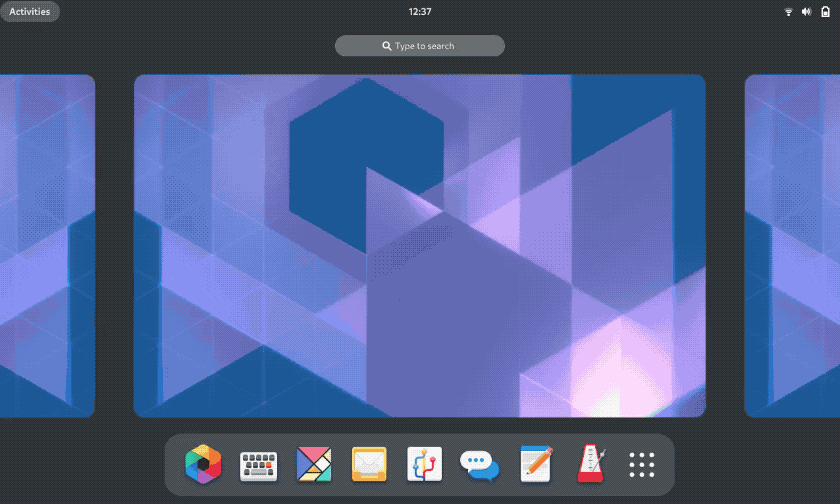

Окружение Gnome напоминает MacOS. Здесь панель с главным меню и различными значками расположена вверху экрана как и в Mac OS, все элементы интерфейса стремятся быть простыми и плавными. Боковую панель со значками приложений можно перенести в низ, чтобы она выглядела как док. Отличается от Mac здесь только главное меню, оно открывает во весь экран список установленных приложений разбитых по категориям, позволяет искать по ним и добавлять их на боковую панель. Файловый менеджер и другие приложения Gnome выглядят минималистично, в интерфейсе нет ничего лишнего. На рабочем столе не так то просто создать ярлык или разместить какой-либо виджет. Декоратор окон максимально простой и поддерживает только базовые эффекты и анимации.

  
**Кому подойдёт**: обладателям систем с сенсорными экранами, планшетов и трансформеров, а также тем, кто привык к macOS.  
**Преимущества**: красиво и современно выглядит, удобен и быстр, поддерживает много расширений, имеет большое количество настроек.  
**Недостатки**: довольно тяжеловесный. Не всем пользователям придётся по душе интерфейс, ориентированный на сенсорные устройства.

