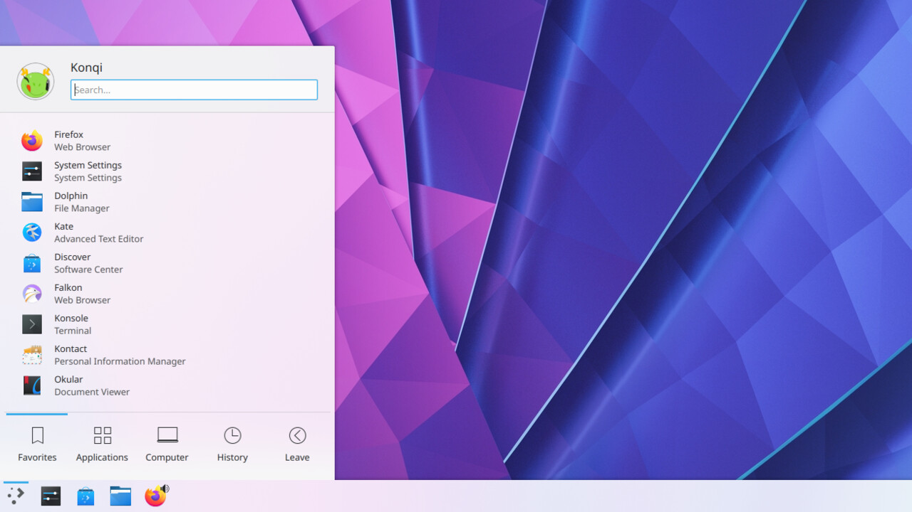

Окружение KDE стремиться быть похожим на Windows. Здесь панель размещена внизу экрана. Главное меню напоминает меню Пуск из Windows. На рабочем столе можно создавать не только ярлыки, но и расположить множество различных виджетов. Приложения KDE содержат в своём интерфейсе множество мелких элементов и огромное количество различных кнопок и настроек, которые в большинстве случаев не нужны. Декоратор окон поддерживает различные эффекты прозрачности, а также эффекты для перемещения, сворачивания и разворачивания окон.

  
**Кому подойдёт**: продвинутым пользователям, которым нужно много возможностей, и любителям «красивостей».  
**Преимущества**: очень стильно и современно выглядит, чрезвычайно гибко настраивается, имеет огромное количество функций.  
**Недостатки**: потребляет немного больше системных ресурсов, чем другие оболочки. Новичкам будет тяжело разобраться во всём изобилии настроек. Впрочем, оболочкой можно с комфортом пользоваться и в её стандартном виде.

