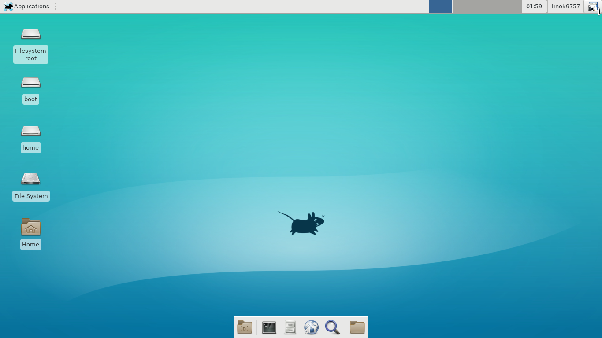

Интерфейс XFCE очень простой. Окружение пытается быть похожим на Gnome, но из-за экономии ресурсов всё выглядит угловатым и не очень красивым, по крайней мере по умолчанию. Панель здесь тоже расположена вверху экрана, а в низу экрана есть док панель. Декорации и другие эффекты будут зависеть от того, какой декоратор окон вы будете использовать. Что касается внешнего вида приложений, то единого стиля нет, так как здесь используются программы как из Gnome, так и из KDE.

  
**Кому подойдёт**: универсальное окружение, которое могут использовать и обладатели старых компьютеров, и любители простых аскетичных интерфейсов.  
**Преимущества**: очень легковесный вариант. При этом присутствует куда больше функций и настроек, чем в LXDE. Симпатично выглядит, хотя опять же неуловимо напоминает Mac OS X Tiger.  
**Недостатки**: Выглядит несколько архаично

