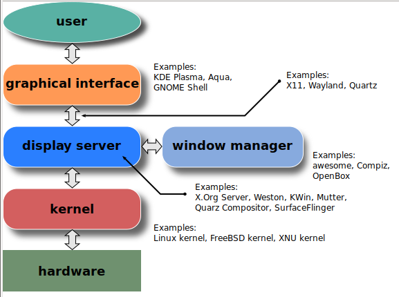

Дисплейный Сервер — это программа, которая отвечает за координацию ввода и вывода своих клиентов с остальной частью операционной системы, а также между оборудованием и операционной системой. По сути, благодаря серверу отображения вы можете использовать свой компьютер в графическом режиме (GUI). Без сервера отображения вы были бы ограничены только интерфейсом командной строки (TTY).

Сервер отображения обеспечивает основу для графической среды, так что вы можете использовать мышь и клавиатуру для взаимодействия с приложениями.

Исторически сервер X.Org использовался чаще всего. Это весьма старая и стабильная система отображения. В плане функциональности он весьма раздут и не соответствует философии UNIX-way - обрабатывает печать, управление буферами для рисования, имел свой тулкит, обрабатывал шрифты, имел бинарный транслятор.   Однако доступны различные альтернативы, такие как Mir и SurfaceFlinger. Помимо этого есть сервер визуализации Wayland, который считается будущим в Linux, и его используют самые популярные дистрибутивы. Однако разрабатывается очень медленно(первая альфа версия разрабатывалась 10 лет) и до сих пор имеет много багов.

