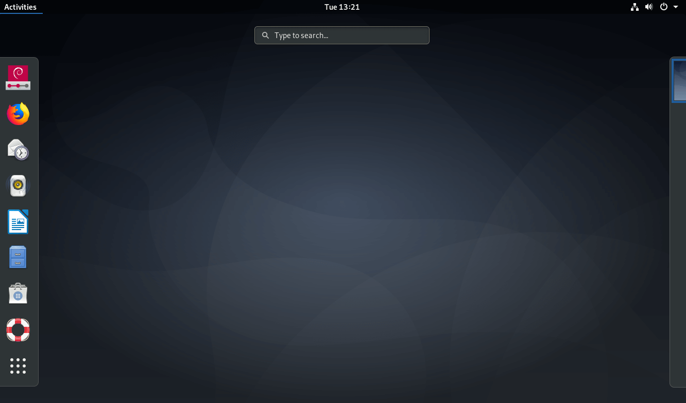

Ubuntu была основана на Debian и если она более ориентирована на домашних пользователей и содержит новое программное обеспечение, то Debian разработан для использования на серверах и максимальной стабильности.  
Пакеты программ, прежде чем попасть в официальные репозитории, проходят долгий путь тестирования, поэтому в дистрибутиве обычно содержатся уже устаревшие версии программ, зато он более стабилен. В качестве системы для серверов это вполне допустимо и оправдано.

  
**Разработчик**: сообщество;  
**Формат** **пакетов**: deb;  
**Окружение по умолчанию**: Gnome;  
**Выход новых версий:** каждые 2 года.

