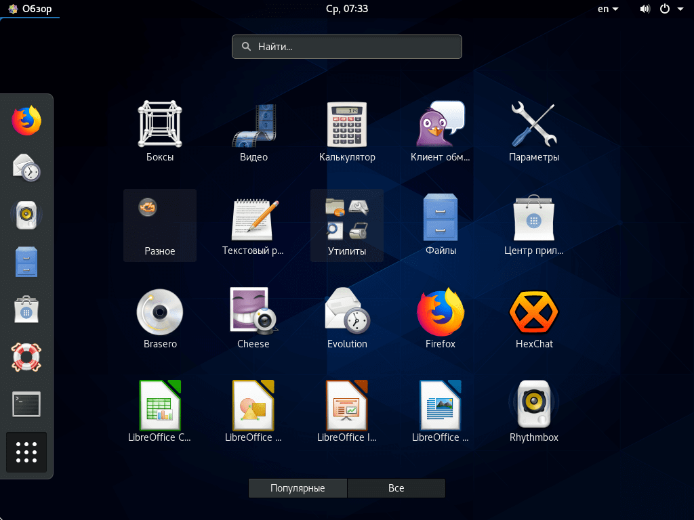

CentOS целиком и полностью основана на исходниках коммерческого дистрибутива Red Hat Enterprice Linux, разработанного в первую очередь для серверов и корпоративной среды.  
Фактически, это свободная версия Red Hat Linux, из которой вырезан весь брендинг и инструменты управления платной подпиской. Дистрибутив поддерживается сообществом энтузиастов, однако это всё ещё тот же очень стабильный RHEL.

  
**Разработчик**: сообщество;  
**Основана на:** RHEL;  
**Формат пакетов:** rpm;  
**Окружение по умолчанию:** Gnome;  
**Выход новых версий:** каждые четыре-пять лет. Но в пределах одного релиза пакеты постоянно обновляются до новых версий.

