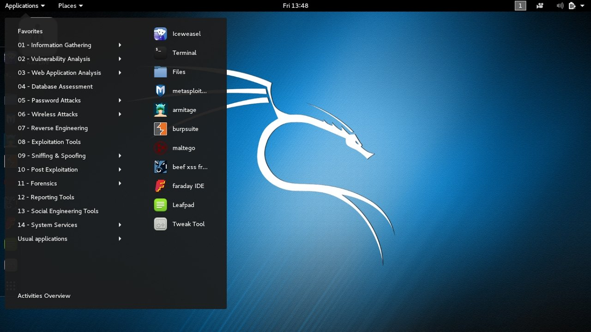

Kali Linux - это дистрибутив для тестирования безопасности компьютерных систем и сетей, который по умолчанию содержит множество инструментов для решения этой задачи. Дистрибутив основан на Debian и разрабатывается сообществом. Он пришёл на смену очень популярному ранее дистрибутиву BackTrack Linux в 2013 году.  
Кроме обычной версии, которая обновляется раз в несколько месяцев, есть версия с роллинг-обновлениями, где пользователи сразу же получают новые пакеты

  
**Разработчик:** сообщество;  
**Основана на:** Debian;  
**Формат пакетов:** deb;  
**Окружение по умолчанию:** XFCE;  
**Выход новых версий:** каждые несколько месяцев.

