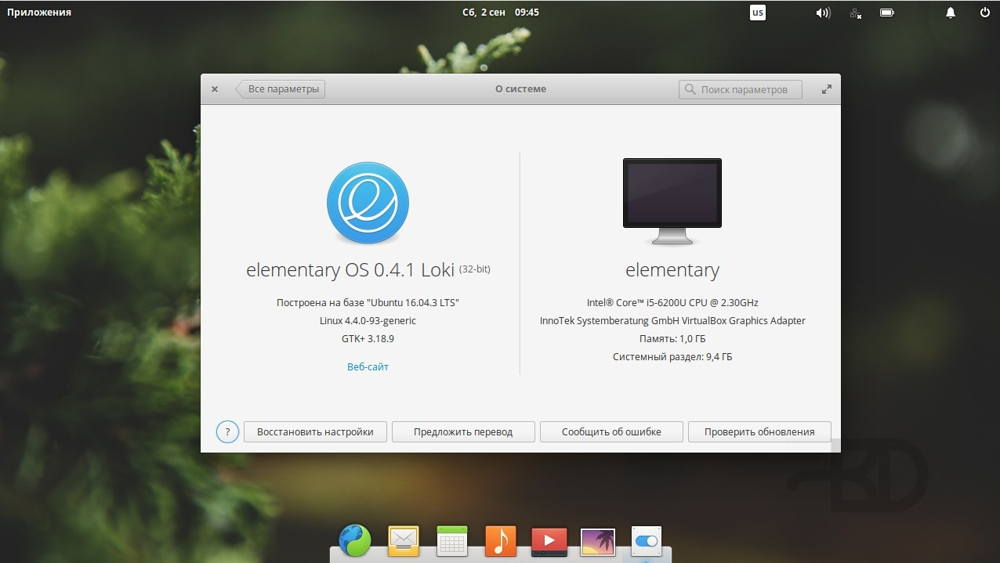

Elementary OS - это дистрибутив, рассчитанный исключительно на домашнее использование. Его разработчики попытались создать очень красивый интерфейс пользователя, похожий на MacOS. В дистрибутиве используется окружение рабочего стола Phanteon, основанное на Gnome и добавляющее несколько визуальных эффектов и элементов.  
Дистрибутив основан на Ubuntu, но имеет ещё одну отличительную черту. Кроме привычных программ, здесь вы можете использовать специальные программы, разработанные для Elementary OS. В системе есть свой файловый менеджер, плеер, терминал и множество других программ для решения различных задач

  
**Разработчик**: сообщество;  
**Основана на:** Ubuntu;  
**Формат пакетов:** deb;  
**Окружение по умолчанию:** Phanteon;  
**Выход новых версий:** каждые два года.

