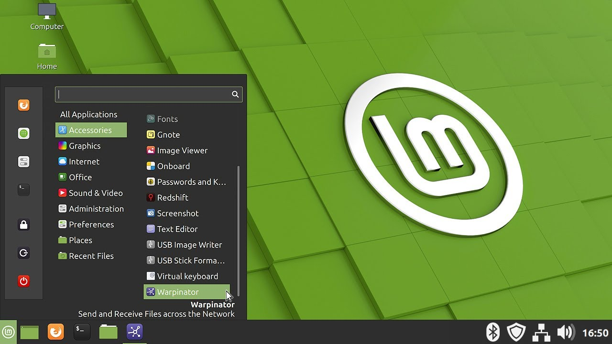

Главная особенность Cinnamon — её простота. В то время, как другие графические окружения пытаются стать чем-то особенным и непохожим на остальные интерфейсы, эта разработка старается быть как можно более дружелюбной к новичкам. Освоить её будет просто даже тем, кто ранее пользовался только Windows, поскольку внешне есть значительное сходство с операционной системой от Microsoft. Панель с открытыми приложениями внизу, слева главное меню и значки быстрого запуска, справа трей и часы.  
При всей своей простоте Cinnamon — это всё же довольно продвинутая и настраиваемая оболочка. Панели и элементы можно перемещать в произвольном порядке. И если вам надоест напоминающий Windows вид, вы легко сможете перекроить интерфейс на свой лад за пару минут.

  
**Кому подойдёт**: пользователям, мигрировавшим с Windows, и новичкам. А также тем, кто хочет простую и понятную графическую среду, чтобы работать, а не любоваться ею.  
**Преимущества**: очень симпатичный внешний вид, в интерфейсе будет просто разобраться. Есть изрядное количество настроек и апплетов.  
**Недостатки**: в официальном репозитории маловато тем. Впрочем, можно качать сторонние с того же Gnome Look

