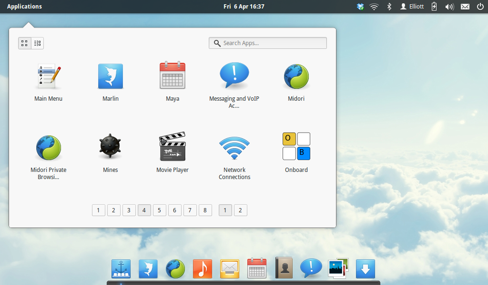

Pantheon разрабатывается группой дизайнеов, поэтому заметно отличается от других графических сред своим довольно эргономичным дизайном. Создатели elementary OS прямо заявляли, что ориентировались на macOS. Pantheon и впрямь похож на эту систему, но есть и различия. Во-первых, по-другому расположены кнопки управления окном, хотя «Закрыть» и находится слева, как привыкли маководы. Во-вторых, от глобального меню разработчики отказались, сделав верхнюю панель прозрачной. Pantheon просто освоить: настройки в ней немногочисленны, запутаться в этой оболочке очень сложно.

  
**Кому подойдёт**: пользователям macOS и новичкам, которые хотят простой и интуитивно понятный интерфейс.  
**Преимущества**: очень быстрая, неплохо выглядит. Анимации окон и панелей смотрятся стильно и приятно.  
**Недостатки**: настроить внешний вид системы не получится. Всё по заветам macOS.

