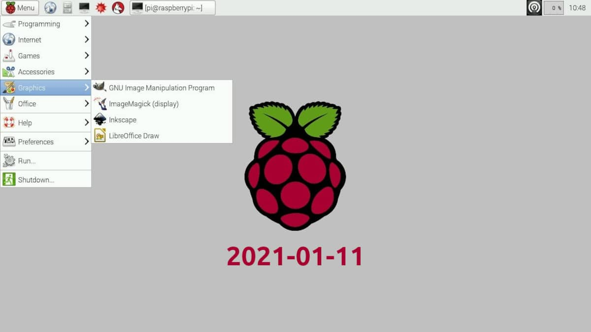
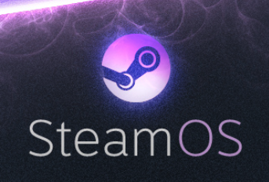

Дистрибутивы отличаются целями, которые ставили создатели. Примеры: Linux Mint основан на Ubuntu, но содержит другой GUI. Debian стремится обеспечить чрезвычайно стабильный дистрибутив. Raspbian - основанная на Debian операционная система для Raspberry Pi, содержащая пакеты собранные специально под маломощный одноплатный компьютер. Steam OS -  операционная система, основанная на Arch Linux, разрабатываемая корпорацией Valve специально для запуска компьютерных игр из магазина цифровой дистрибуции Steam.

