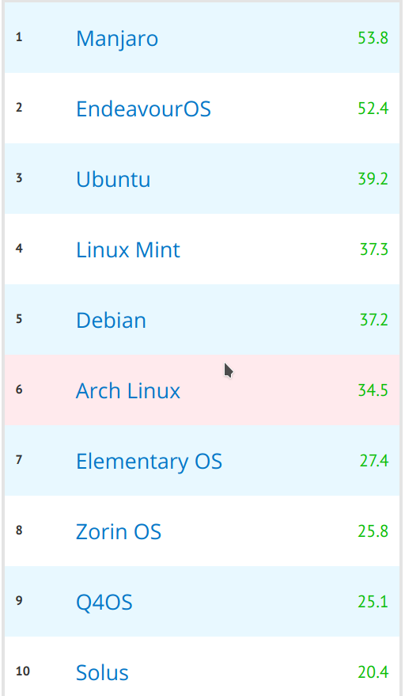

На текущий момент среди дистрибутивов есть явные лидеры в гонке за симпатии пользователей. Среди них можно выделить Ubuntu, Debian, CentOS, Linux Mint, Kali Linux, Fedora, Manjaro Linux, OpenSUSE, Elementary OS, Arch Linux. Однако стоит отметить что этот список релевантен для пользователей десктопного линукс, в серверном сегменте все может быть несколько по другому  
На картинке  представлен рейтинг дистрибутивов по популярности среди пользователей сайта Pingvinus

