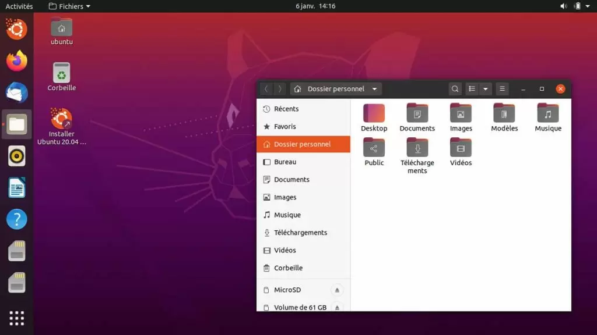

Разработкой Ubuntu занимается Canonical. Компания занимается активным продвижением и популяризацией этой системы ещё с 2004 года. За это время получилась стабильная и надёжная система. По умолчанию в системе используется окружение рабочего стола Gnome, однако, также сообществом выпускаются редакции для других окружений, среди которых есть KDE, LXDE, XFCE, Budgie и MATE. Система имеет собственный удобный и простой установщик, а также часто рекомендуется как самая простая для начинающих

  
**Разработчик**: Canonical;  
**Основана** **на**: Debian;  
**Формат пакетов**: deb;  
**Окружение по умолчанию**: Gnome;  
**Выход новых версий**: каждые 9 месяцев.

