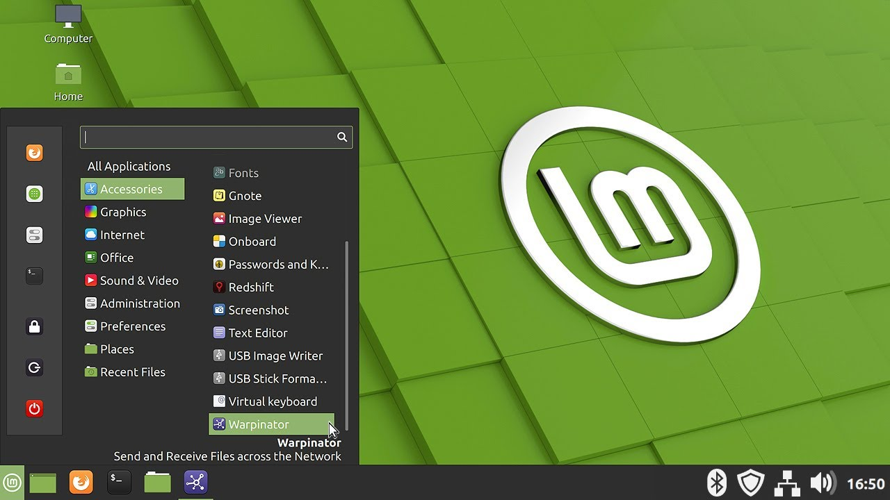

Mint основан на Ubuntu и разрабатывается сообществом. Его целью было сделать установку и первоначальную настройку системы проще, а рабочее окружение привычнее. Вместе с дистрибутивом поставляются различные проприетарные драйверы, упрощена установка дополнительных кодеков.  
Кроме того, когда был выпущен Gnome 3, разработчики Linux Mint начали работу над собственным окружением - Cinnamon, которое использует те же современные технологии, что и Gnome 3, такие как GTK 3, но выглядит более просто и привычно. Ещё Linux Mint содержит набор дополнительных инструментов и утилит для упрощения настройки и использования системы.

  
**Разработчик:** сообщество;  
**Основана на:** Ubuntu;  
**Формат пакетов:** deb;  
**Окружение по умолчанию:** Cinnamon;  
**Выход новых версий:** каждые два года, на основе LTS версии Ubuntu, а также промежуточные версии.

