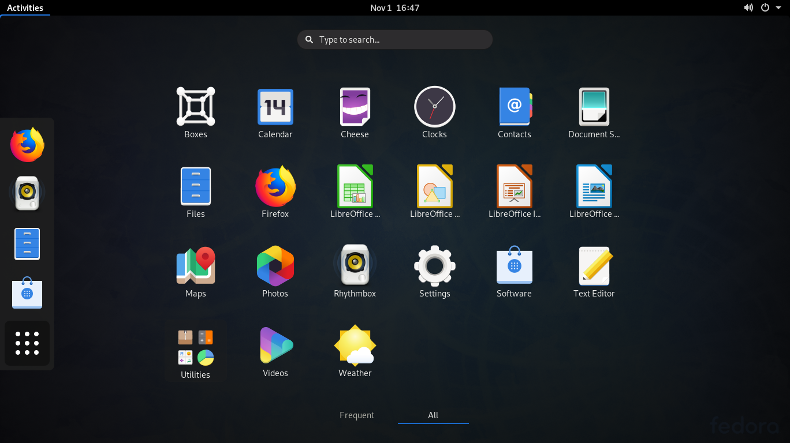

Дистрибутив Fedora Linux разрабатывается сообществом при поддержке компании Red Hat. В этом дистрибутиве обкатываются и тестируются все новые технологии, которые в будущем войдут в релиз Red Hat Enterprice Linux. Например, ещё несколько лет назад в Fedora был включён пакетный менеджер DNF. По умолчанию в Feodra используется окружение Gnome. Установщик дистрибутива похож на установщики других RPM-дистрибутивов. По моему мнению, это один из самых сложных установщиков, так как вместо простых шагов мастера вам приходится самому выбирать пункты настройки.

  
**Разработчик:** сообщество;  
**Формат пакетов:** rpm;  
**Окружение по умолчанию:** Gnome;  
**Выход новых версий:** каждые шесть месяцев.

