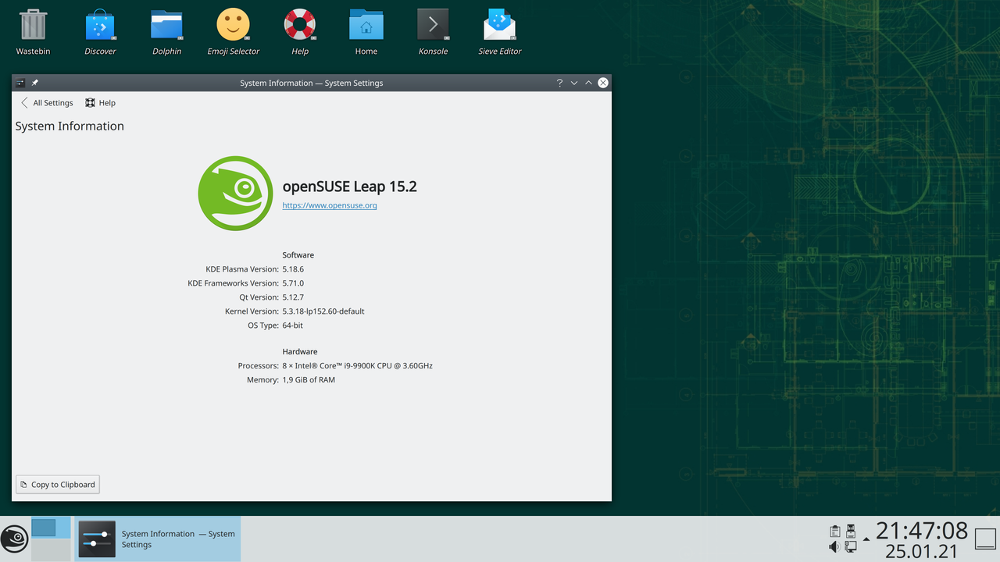

За разработку OpenSUSE отвечает компания SUSE. У неё длинная история и компания несколько раз уже была частью других больших корпораций, но сейчас она находится под контролем EQT. Компания разрабатывает несколько версий дистрибутива. Это версия для серверов и рабочих станций - SUSE Linux Enterprise, и свободная версия - OpenSUSE.  
В дистрибутиве используются пакеты формата RPM, но применяется собственный пакетный менеджер zypper, который позволяет загружать патчи для обновления пакетов и имеет другие преимущества. Дистрибутив использует btrfs в качестве файловой системы по умолчанию, а также имеет утилиту YaST для удобной настройки системы, в которой, кроме стандартных возможностей, поддерживаются снимки файловой системы, резервное копирование и восстановление.

  
**Разработчик:** SUSE;  
**Основана на:** нет;  
**Формат пакетов:** rpm;  
**Окружение по умолчанию:** нет;  
**Выход новых версий:** каждый год.

