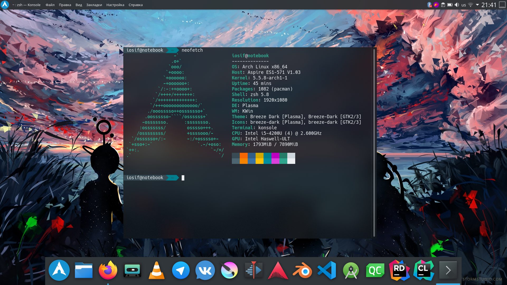

Он рассчитан только на опытных пользователей, которые хотят настроить систему под себя и установить только то, что им нужно.  здесь нет графического установщика, и вам придётся устанавливать все пакеты через терминал. Поэтому вы можете установить только те, пакеты, которые захотите. И в процессе этого у вас будет отличная возможность изучить внутреннюю структуру системы.  
Arch Linux был одним из первых дистрибутивов, которые предлагали систему rolling-релизов. Это значит, что никакие новые версии не выпускаются в репозиториях всегда находится самая новая версия операционной системы. Плюс такого подхода - пользователи всегда получают самые новые программы, а недостаток - это низкая стабильность. Ещё одно преимущество Arch Linux - это огромная документация Arch Wiki, в которой есть ответы на множество вопросов и решения для многих проблем.

  
**Разработчик:** сообщество;  
**Основана на:** нет;  
**Формат пакетов:** pkg;  
**Окружение по умолчанию:** нет;  
**Выход новых версий:** rolling.

