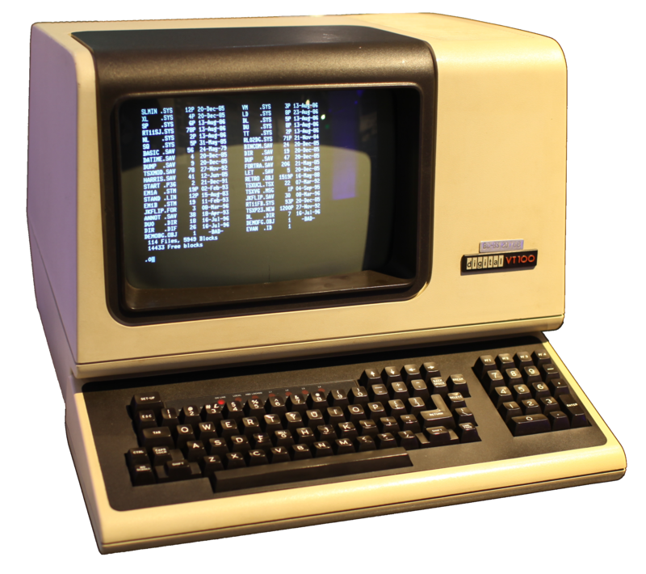
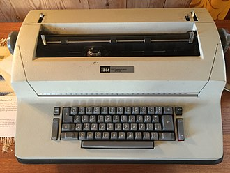

Основным интерфейсом взаимодействия между ЭВМ и человеком в классической операционной системе UNIX был единственно возможный, диктуемый аппаратными устройствами ее времени командный интерфейс. Называемый сегодня ин­терфейсом командной строки, он в неизменном виде сохранил все свои элементы — понятие терминала, двусторонний попеременный диалог, управляющие символы и клавиши для их набора.  
Терминал является конечным (от англ, terminal) оборудованием, предназначенным для организации человеко-машинного интерфейса. Обычно он состоит из устройств вывода — принтера или дисплея, и устройств ввода — клавиатуры, манипулятора «мышь» и пр.  
Алфавитно-цифровой терминал позволяет вводить и выводить символы из неко­торого заданного набора (например, семибитной кодировки ascii(7)) или другого на­бора символов charsets(7), состоящего из букв алфавита, цифр, знаков препинания, некоторых других значков, и символов специального назначения для управления самим терминалом — управляющих символов.  
Ранние, печатающие терминалы, представляли собой телетайпы, которые печатали символы из фиксированного набора на ленте или рулоне бумаги — слева направо, сверху вниз.  
Дисплейный терминал (видеотерминал на основе электронно-лучевой трубки) в упрощенном своем режиме эмулирует поведение печатающего терминала: поворачивающийся рулон бумаги — при помощи скроллинга изображаемых строк сни­зу вверх, а перемещающуюся вдоль строки печатающую головку — при помощи курсора. В расширенном режиме видеотерминал используется как матрица симво­лов, например в 24 строки по 80 символов в строке, и позволяет выводить сим­волы в произвольное место матрицы, задавать символам стиль изображения, как то: мерцание, жирность, инвертирование, подчеркивание и цвет, — и даже менять шрифты символов терминала. Для управления курсором, его позиционирования, смены стиля изображения символов и прочих возможностей видеотерминала при­меняются управляющие символы и управляющие последовательно­сти.  
Двусторонний попеременный диалог командного интерфейса между поль­зователем и операционной системой представляет собой процесс ввода команд.  
В начале сеанса работы в многопользовательской среде операционной системы пользователь должен произвести регистрацию ( logging in) себя в системе (обычно говорят «произвести вход» в систему) при помощи предъявления имени своей  
учетной записи (login) и соответствующего ему пароля (password).  
Процедура регистрации начинается с заставки операционной системы О и пригла­шения к вводу имени учетной записи, в ответ на которое пользователь вводит имя своей учетной записи. Затем, в ответ на приглашение к вводу пароля, пользователь вводит пароль, и при этом на алфавитно-цифровых терминалах никакие символы не изображаются. При положительном исходе регистрации поль­зователь получает сообщение о последней (last) успешной регистрации, сооб­щение дня и приглашение командного интерпретатора.

  
Приглашение командного интерпрета­тора исторически состояло из символа $ или символа ^, а при регистрации под учетной записью администратора — из символа #. Позднее приглашение развилось в finn@ubuntu:~$ и состоит теперь из имени зарегистрировавшегося пользователя finn, собственного имени компьютера ubuntu, условного имени домашнего каталога пользователя, обозначенного символом ~, и «классического» символа приглашения $.  
Сеанс командного интерфейса пользователя продолжается двусторонним попере­менным диалогом с командным интерпретатором, где пользователь вводит команды и получает результаты их выполнения.  
На текущий момент времени многопользовательские системы с настоящими физи­ческими терминалами, подключенными посредством интерфейса RS232 и его драй­вера ttyS к большой ЭВМ, — экзотическая редкость. На персональных ЭВМ для взаимодействия с пользователем используются стандартные клавиатура, видео­-адаптер и монитор, формирующие так называемую командную оболочку, которая использу­ется драйвером виртуальных терминалов для эмуляции нескольких физических терминалов.

