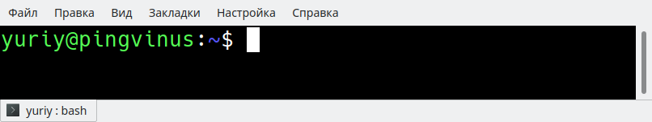

Приглашение ко вводу команд в bash — это строка, которая отображается слева от каждой команды, которую вы вводите в терминале. Обычно приглашение имеет вид пользователь@hostname:директория$  
Приглашение можно настраивать. Можно добавлять информацию или, например, изменить цвет приглашения.  
Формат строки приглашения задается в переменной окружения PS1. Чтобы настроить приглашение, необходимо изменить значение переменной PS1.  
Например, переменная PS1 может иметь значение:  
`PS1="\u@\h:\w$"`

