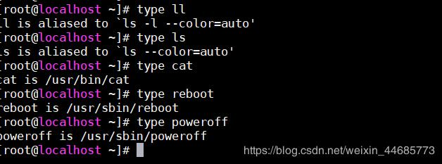

Команды оболочки бывают двух типов  
**Внутренние команды**: команды, встроенные в оболочку. Для всех встроенных команд оболочки их выполнение выполняется быстро в том смысле, что оболочке не нужно искать их по заданному пути в переменной PATH, а также не нужно создавать процесс для ее выполнения.  
Примеры: **source, cd, fg** и т.д.  
**Внешние команды**: команды, которые не встроены в оболочку. Когда необходимо выполнить внешнюю команду, оболочка ищет свой путь, указанный в переменной PATH, а также должен быть создан новый процесс, и команда будет выполнена. Обычно они находятся в /bin или /usr/bin. Например, когда вы выполняете команду «cat», которая обычно находится в /usr/bin, исполняемый файл /usr/bin/cat выполняется. Примеры: **ls**, **cat** и т.д.

  
Рассмотрим команду **ls** . Поскольку ls — это программа или файл, существующий независимо в каталоге /bin (или /usr/bin), он обозначается как внешняя команда, что фактически означает, что команда ls не встроена в оболочку, и это исполняемые файлы, присутствующие в отдельный файл. Проще говоря, когда вы введете команду ls, которая будет выполнена, она будет найдена в /bin. Большинство команд по своей природе являются внешними, но есть некоторые, которые на самом деле нигде не найдены, а некоторые обычно не выполняются, даже если они находятся в одном из каталогов, указанных в PATH. Например, возьмем команду echo, она не является внешней командой в том смысле, что когда вы набираете echo, оболочка не будет искать в своем PATH, чтобы найти его (даже если она есть в /bin). Скорее, он будет выполнять его из своего собственного набора встроенных команд, которые не хранятся в виде отдельных файлов. Эти встроенные команды, членом которых является echo , называются внутренними командами .

Вы можете получить список встроенных команд оболочки с помощью команды **help.**  
В дополнение к этому вы также можете узнать о конкретной команде, внутренней или внешней, с помощью команды **type** :  
`type cat`  
`cat is /bin/cat`  
`type cd`  
`cd is a shell builtin`

