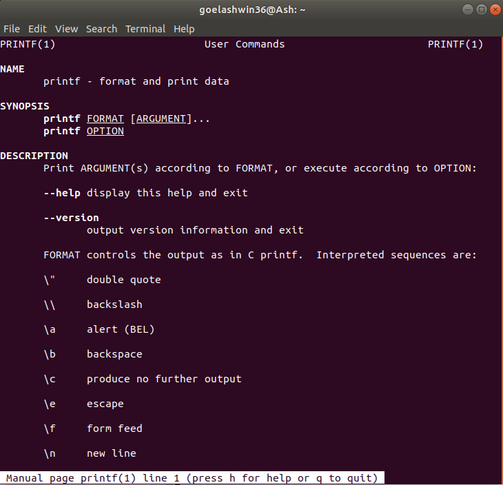

Зачастую, начинающий пользователь, не зная как выполнить какое-либо действие в Терминале, сразу задаёт вопрос (иногда довольно глупый) в Форуме. Особенно это свойственно тем, кто совсем недавно обратил свой взор на операционные системы, отличные от Windows.   
Но в большинстве случаев проблему можно решить своими силами. Ведь для этого часто бывает достаточно почитать справку по используемой команде или же использовать страницы man.  
Практически у каждой команды Linux-системы есть (хотя бы и очень краткая) справочная информация. Чтобы её вызвать, достаточно запустить команду с аргументами -**h** или **--help.** Например, для команды ls: 

`$ ls --help`  
`Usage: ls [OPTION]... [FILE]...`  
`List information about the FILEs (the current directory by default).`  
`Sort entries alphabetically if none of -cftuSUX nor --sort.`  
...

 

Man команда Unix, предназначенная для форматирования и вывода справочных страниц. Каждая страница справки является самостоятельным документом и пишется разработчиками соответствующего программного обеспечения. Эти файлы хранятся в папке /usr/share/man  
Чтобы вывести справочное руководство по какой-либо команде (или программе, предусматривающей возможность запуска из терминала), можно в консоли ввести:

**man** <command\_name>  
Рассмотрим горячие клавиши, которые могу пригодится при использовании man  
Для навигации в справочной системе man можно использовать клавиши ↑ и ↓ для построчного перехода, PgUp и PgDn для постраничного перехода вверх и вниз соответственно.  
При просмотре больших страниц удобно воспользоваться поиском, для чего следует нажать /, ввести строку для поиска и нажать ↵ Enter. Обратным поиском (снизу вверх) можно воспользоваться, нажав кнопку ?. При этом будут подсвечены все совпадения с заданным регулярным выражением, и экран прокрутится до первого из них. Для перехода к следующему подсвеченному вхождению нужно нажать n (Next — следующий) либо оставить строку поиска пустой (/, затем - ↵ Enter). Для показа предыдущего совпадения надо также использовать вопросительный знак или же нажимать N (заглавную, то есть Shift+N).  
Для получения краткой справки по командам и горячим клавишам справочной системы нужно нажать H (Help — помощь).  
Для выхода из справочной системы используется клавиша Q (Quit — выход).

  
В некоторых случаях разработчики помещают некоторую дополнительную информацию по описанию команд, устройств, форматов файлов и других компонентов Linux в информационную базу данных. Чтобы получить доступ к этой базе необходимо набрать info (для выхода из утилиты **info** используется q):  
`$ info ls`  
При этом будет показана информация по команде ls. Можно перемещаться по информации с помощью клавиш навигации (стрелки), а так же с помощью Page UP и Page Down. Файлы, которые использует такая информационная база данных, находится в директории /usr/share/info. 

