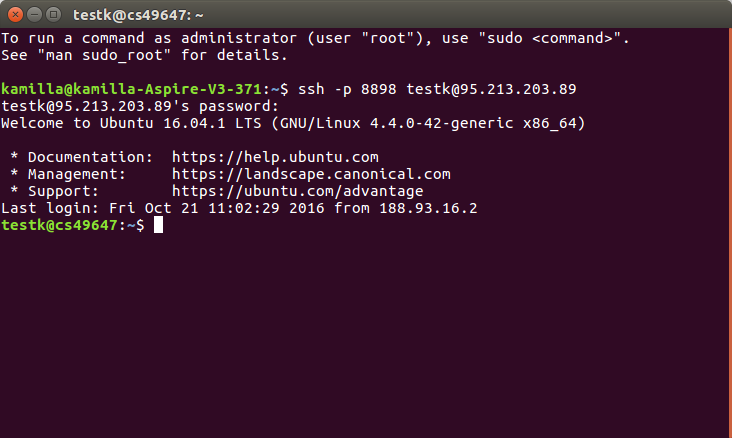

Операционные системы семейства Linux, как впрочем, и любые другие ОС, предполагают наличие интерфейса взаимодействия между компонентами компьютерной системы и конечным пользователем, т.е. наличие программного уровня, который обеспечивает ввод команд и параметров для получения желаемых результатов. Такой программный уровень получил название "оболочка" или, на английском языке - shell.  
Командная оболочка ( shell ) обеспечивает взаимодействие между пользователем и средой операционной системы Linux. Она является специализированным программным продуктом, который обеспечивает выполнение команд и получения результатов их выполнения, или, если совсем уж упрощенно, оболочка - это программа, которая предназначена для обеспечения выполнения других программ по желанию пользователя. Примером оболочки может быть, например, интерпретатор команд command.com операционной системы MS DOS, или оболочка bash операционных систем Unix / Linux.  
Все оболочки имеют схожие функции и свойства, в соответствием с их основным предназначением - выполнять команды пользователя и отображать результаты их выполнения:  
- Интерпретация командной строки.  
- Доступ к командам и результатам их выполнения.  
- Поддержка переменных , специальных символов и зарезервированных слов.  
- Обработка файлов, операций стандартного ввода и вывода.  
Оболочка пользователя ( shell ) в Linux.

Операционные системы семейства Linux, как впрочем, и любые другие ОС, предполагают наличие интерфейса взаимодействия между компонентами компьютерной системы и конечным пользователем, т. е. наличие программного уровня, который обеспечивает ввод команд и параметров для получения желаемых результатов. Такой программный уровень получил название "оболочка" или, на английском языке - shell.

Для операционных систем семейства Unix / Linux возможно использование нескольких различных оболочек, отличающихся свойствами и методами взаимодействия с системой. Наиболее распространенными оболочками являются  
sh - оболочка Bourne , классическая оболочка для ОС Unix  
bash оболочка Bourne Again (GNU Bourne-Again SHell). Пожалуй, наиболее распространенная на данный момент, оболочка в среде ОС семейства Linux.  
ksh - оболочка Korn, разработанная в качестве развития оболочки Bourne с историей командной строки и возможностью редактирования команд.  
csh - оболочка C, использующая синтаксис популярного языка программирования C

