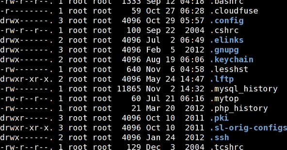

Файлы с точкой (по английски называются **dotfile** – дот-файл) – это конфигурационные файлы в Unix системах. Каждый такой файл начинается с символа точки (.), чтобы команды и файловые менеджеры не показывали этих файлов по умолчанию. Так что да, это скрытые файлы. Можно создавать сколько угодно таких файлов, но общие правила для них такие же, как и для других файлов. Например, нельзя создать два файла с точкой, которые имеют одно и то же имя в одном и том же каталоге.

  
Большинство дот-файлов находится в домашних каталогах пользователей. Системные (глобальные) настройки вашего Linux хранится централизованно и сравнительно открыто в каталоге /etc, а вот приватные индивидуальные настройки – у каждого пользователя в его собственном каталоге.  
Для пользователя user файлы с точкой находятся в /home/  
Многие проекты создают дот-файлы при первом запуске. Файлы хранятся в вашем личном домашнем каталоге, поэтому один и тот же продукт может использоваться несколькими пользователями – и у каждого будут свои настройки.

Вот только несколько дот-файлов из домашнего каталога:  
**.bashrc** – общие настройки для оболочки Bash на Linux  
**.vimrc** – настройки редактора ViM  
**.gitconfig** – конфигурация системы git

Многие дотфайлы на самом деле являются директориям, многие проекты хранят свои файлы в специальном скрытом подкаталоге – например **.ssh** или **.vnc**

Одним из dotfile является файл **.bashrc.** Назначение **.bashrc** файла - предоставить место, где вы можете установить переменные окружения, а также можете добавить свои функции командной оболочки или псевдонимы существующих команд, определить приглашение к вводу (PS1) и определить другие параметры, которые вы хотите использовать при каждом запуске, когда вы открываете новое окно терминала.

