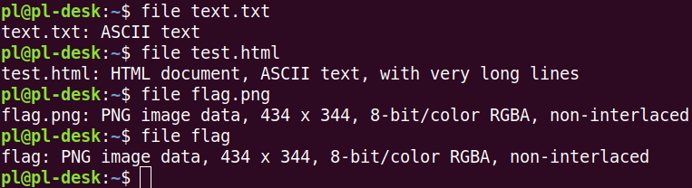

Хотя выше было сказано, что Линукс не делает предположение о типе данных в обычном файле, есть специальная утилита, которая выполняет эту задачу, – программа file. Для этого она анализирует начало содержимого файла и находит в нем специальные "сигналы", характерные для определенного типа – бинарного файла, текстового, изображения и др.  
На скриншоте также показано, что расширение для программы file безразлично. Файл flag – копия flag.png, и программа успешно его идентифицировала как изображение.

