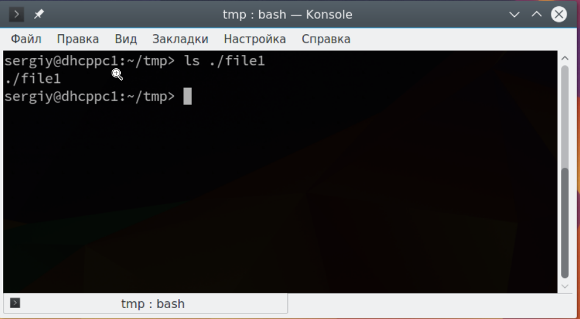

Глобально уникальным идентификатором файла в пределах операционной системы является его абсолютное путевое имя, определямое как путь от корня дерева каталогов до целевого файла, включая начало и конец пути.  
Необходимо акцентировать внимание на том, что имя у корневого каталога отсутствует, т.е. является пустой строкой. Таким образом, абсолютное  путевое имя файла image.jpg в папке пользователя записывается как разделенные символом / имена всех каталогов пути и имя самого файла — /home/user/Изображения/image.jpg

