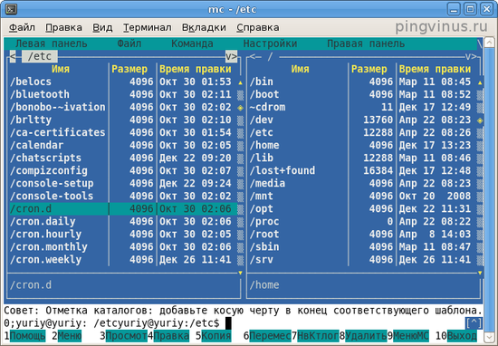
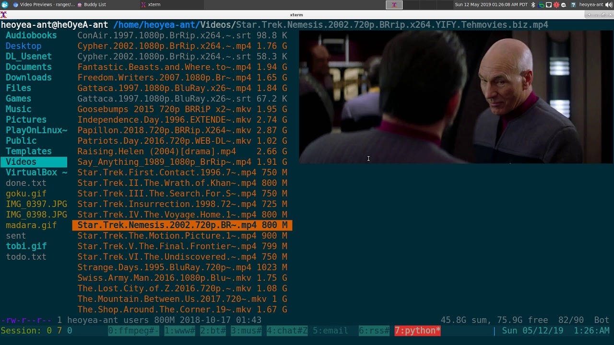

В каждой графической оболочке linux есть свой gui файловый менеджер (например в kde dolphin). Однако в некоторых ситуациях графическая оболочка может быть вам недоступна. Рассмотрим пару из них.

**Midnight Commander**

**Midnight Commander** - это файловый менеджер с текстовым пользовательским интерфейсом. TUI (Text User Interface) – это наполовину CLI и наполовину GUI. Непонятно, что это значит? Разберёмся поподробнее.

Как было сказано выше, работа со старыми компьютерами была целиком основана на CLI. Однако некоторый ограниченный спектр возможностей GUI можно имитировать и в текстовом терминале. Это и будет TUI: в отличие от интерфейса командной строки, в нём представлено больше виджетов и доступно управление как и с клавиатуры, так и с помощью мыши.  
TUI – это сокращение для text-based user interface (текстовый пользовательский интерфейс) или terminal user interface (терминальный пользовательский интерфейс). Слово "текстовый" в этом словосочетании означает, что всё показанное на экране, в сущности, представляет собой большой текст – набор символов, с помощью которого имитируются различные элементы управления, а слово "терминальный" – что обратиться к этому интерфейсу возможно только из терминала.  
TUI-приложения не так популярны, как GUI и CLI, но примеров можно найти множество. Так, к этой категории относятся текстовые браузеры и текстовые игры.

Он особенно полезен, когда нет возможности запустить графическую оболочку, но также может использоваться в качестве основного файлового менеджера в графическом интерфейсе. Его можно запускать практически в любой оболочке командной строки и даже в SSH сессии.  
Пользовательский интерфейс программы делится на две панели, каждая из которых отображает содержимое директории. В верхней части каждой панели отображается текущий каталог. Навигация осуществляется с помощью клавиш стрелок. Клавиша Enter используется для открытия папки. В самом верху программы есть меню с пунктами настройки программы, левой и правой панели, а также различными операциями для файлов.

**Особенности**:

* поддержка мыши и клавиатуры в графическом интерфейсе;
* встроенный инструмент просмотра и редактирования с подсветкой синтаксиса;
* поддержка создания и распаковки архивов (rpm, deb, tgz, iso, rar, cpio);
* поддержка кодировки Unicode;
* горячие функциональные клавиши для разных действий;
* строка терминала для выполнения команд.

**Ranger**  
Еще одним консольным текстовым менеджером является **Ranger** — минималистичный консольный файловый менеджер. 

  
Основные возможности и особенности программы Ranger:

* Файловый менеджер Ranger имеет минималистичный текстовый интерфейс.
* Каждый каталог отображается как отдельная панель. При переходе в новый каталог, он открывается (как следующий уровень иерархии) справа от текущего каталога. Текущий список файлов в каталоге отображается в самой правой части (в правой панели).
* Можно создавать вкладки. Текущая вкладка и номера вкладок отображаются в правом верхнем углу. Для переключения между вкладками используется клавиша Tab или сочетание Alt+номер вкладки
* Все действия можно выполнять с использование клавиатурных сочетаний или команд. Поддерживается навигация мышкой. Для комфортной работы необходимо обязательно ознакомиться с горячими клавишами.
* Для получения справки по использованию программы выполните в терминале команду: man ranger или нажмите клавишу ? прямо в программе, а затем выберите информацию, которую вы хотите просмотреть (список в нижней строке).
* Внизу расположена строка для ввода команд в стиле VIM.
* Быстрое переключение между директориями и просмотр файлов.
* Просмотр содержимого файлов.
* Просмотр изображений прямо в файловом менеджере (может потребоваться установка дополнительных пакетов).
* Поддержка основных операций с файлами (создание, копирование, перемещение, удаление, chmod и так далее).
* Массовое переименование файлов.
* Консоль в стиле VIM.
* Поддержка горячих клавиш из VIM.
* Поддержка вкладок.
* Поддержка закладок.
* Поддержка управления мышкой.
* Поставляется с утилитой rifle, которая предназначена для открытия (запуска) файлов. Она автоматически определяет программу, которая требуется для открытия выбранного файла.
* Поддержка цветовых схем.
* Поддержка UTF-8.
* Изменение директории оболочки после закрытия программы.
* Поддержка плагинов.
