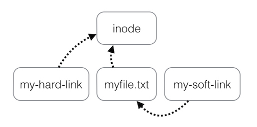

Файлы и каталоги физически хранятся на устройстве хранения в виде набора блоков. Информация о файле (владелец, права доступа, размер файла, время последнего обращения, признак каталога и т. д.) хранится в inode — индексном дескрипторе. Номер inode также называют порядковым номером файла. Этот номер является уникальным в пределах отдельной файловой системы. Запись каталога содержит имя файла (или каталога), а также указатель на дескриптор inode, в котором хранится информация об этом файле (каталоге).  
Ссылки — это дополнительные записи каталога, позволяющие обращаться к файлам или каталогам по нескольким именам. Жесткая ссылка — это запись каталога, указывающая на дескриптор inode, а мягкая (или символическая) ссылка — это запись каталога, указывающая на имя объекта с другим inode.

