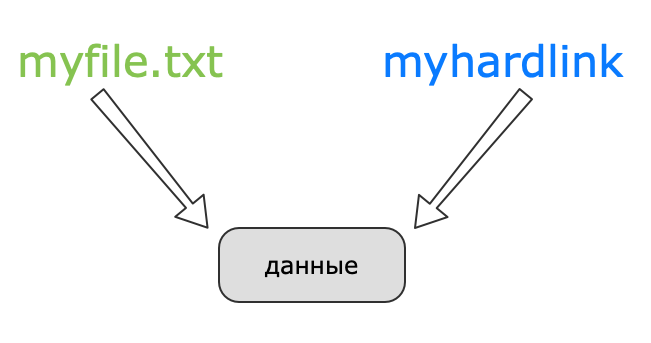
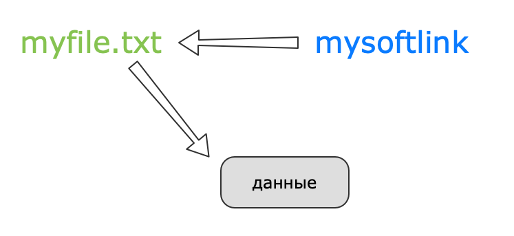

**Жесткие ссылки**  
Жесткие ссылки можно создать только для файлов, для каталогов их создать невозможно. Исключение составляют лишь специальные записи каталогов, указывающие на сам каталог и на ее родительский каталог, — то есть . и .. являются жесткими ссылками. При попытке создать ссылку для каталога вы увидите следующее сообщение об ошибке:  
ln: 'link': hard link not allowed for directory  
ln: 'link': не допускается создавать жесткие ссылки на каталоги

Жесткие ссылки можно использовать только в пределах одной файловой системы, поскольку они являются указателями на дескрипторы inode, которые, как уже отмечалось, являются уникальными только в пределах отдельной файловой системы.  
Файл удаляется только тогда, когда удаляется последняя ссылка на его inode, и счетчик ссылок сбрасывается до 0. 

**Мягкая ссылка**  
Мягкая (или символическая ссылка, symlink) указывает на имя другого файла или каталога, а не на его inode. В этом и есть различие мягких ссылок от жестких. Мягкие ссылки можно создавать на объекты разных файловых систем, а также на каталоги. Удаление мягкой ссылки не приводит к удалению файла или каталога, на которую она указывает, а удаление целевого объекта не приводит к автоматическому удалению мягких ссылок. Другими словами, если у вас есть файл file.txt и вы создали на него символическую ссылку symlink.txt, то в случае удаления файла file.txt ссылка окажется «битой» — она не будет ни на что указывать.

 

|  |  |
| --- | --- |
| **Жесткая** | **Мягкая** |
|  можно создать только для файлов  | На любой тип данных |
| можно использовать только в пределах одной файловой системы | В пределах разных файловых систем |
| Указывает на inode | Указывает на имя другого файла или каталога |
| Файл удаляется когда все жесткие ссылки удалены | Файл и ссылка независмы друг от друга — ссылка становится битой, если файл удален |

 

 

