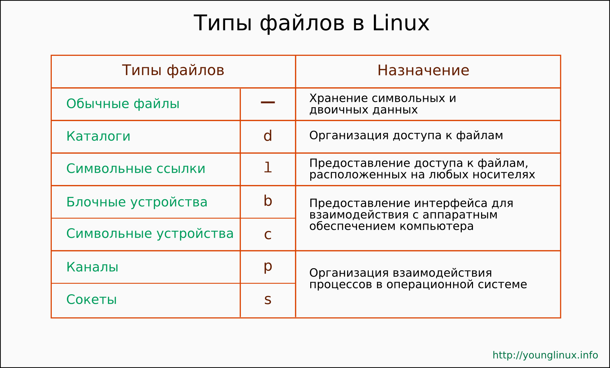

В GNU/Linux как и других Unix-подобных операционных системах понятие типа файла не связано с расширением файла (несколькими буквами после точки в конце имени), как это обстоит в Windows. Unix-подобная ОС не следит за расширениями файлов. Задача связать расширения файла с конкретным пользовательским приложением, в котором этот файл будет открываться, лежит на какой-либо прикладной программе. В свою очередь пользовательское приложение анализирует структуру данный файла, расширение ему также безразлично. Таким образом, среди файловых атрибутов, хранящихся в операционной системе на базе ядра Linux, нет информации о типе данных в файле. Там есть информация о более существенном разделении, связанном с тем, что в Unix-подобных системах все объекты – это файлы. Все объекты весьма разнообразны. Поэтому тип файла в Linux – это скорее тип объекта, но не тип данных как в Windows.  
В операционной системе GNU/Linux существуют следующие типы файлов: обычные файлы, каталоги, символьные ссылки, блочные устройства, символьные устройства, сокеты, каналы. Каждый тип имеет собственное обозначение одним символом. Знание этих символов нам пригодится в дальнейшем при изучении командной оболочки Bash.

  

**Обычные файлы (-)**  
Сюда относятся все файлы с данными, играющими роль ценной информации сами по себе. Linux все-равно текстовый перед ним файл, исполняемый или картинка. В любом случае это будет обычный (regular) файл. Все они обозначаются знаком минус "-". Остальные типы файлов считаются специальными (special).  

**Каталоги (d)**  
В Linux каталог представляет собой такой тип файла, данными которого является список имен других файлов и каталогов, вложенных в данный каталог. В файле каталога осуществляется связь между именами файлов (словесного обозначения для людей) и их индексными дескрипторами (истинным именем-числом, которым оперирует ОС).  
В Unix-подобных системах один и тот же файл может существовать под разными именами и/или в разных каталогах: все имена будут связаны с одним и тем же индексным дескриптором (механизм жестких ссылок).  
Также следует, что файлы всегда должны содержаться в каталогах, иначе станут недоступны, так как нигде не будет содержаться записи о них.  

**Cимвольные ссылки (l)**  
Символьная ссылка – это файл, в данных которого содержится адрес другого файла по его имени (а не индексному дескриптору). Выполнение символьной ссылки приводит к открытию файла, на который она указывает. Это аналог ярлыков в операционной системе Windows. Если удалить исходный файл, то символьная ссылка продолжит существовать. Она по-прежнему будет указывать на файл, которого уже нет. Символьные ссылки не содержат атрибутов файлов, на которые они указывают. У них есть собственные атрибуты.

**Символьные (c) и блочные устройства (b)**  
Файлы устройств предназначены для обращения к аппаратному обеспечению компьютера (дискам, принтерам, терминалам и др.). Когда происходит обращение к файлу устройства, то ядро операционной системы передает запрос драйверу этого устройства.  
К символьным устройствам обращение происходит последовательно (символ за символом). Примером символьного устройства может служить последовательный порт.  
Считывать и записывать информацию на блочные устройства можно в произвольном порядке, причем блоками определенного размера. Пример: жесткий диск.

**Сокеты (s) и каналы (p)**  
Чтобы понять, что такое канал и сокет, необходимо понимание процессов в операционной системе. И каналы и сокеты организуют их взаимодействие. Пользователь с данными типами файлов почти не сталкивается.  
Ключевым отличием канала от сокета является то, что канал однонаправлен. Через канал один процесс всегда передает данные второму, но не наоборот. Сокеты позволяют передавать данные в разных направлениях, т. е. осуществляют связь.  
Также следует отметить, что канал представлен в структуре каталогов файлом, только если он именован. Когда возникают безымянные каналы, то они существуют только внутри ядра Linux.

