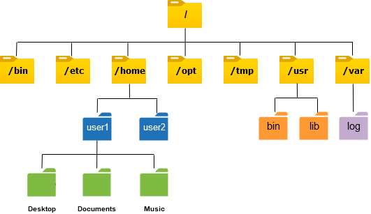

Файловая система любого дистрибутива Linux содержит следующие каталоги:

  
**/** — корневой каталог;

**/bin** – содержит стандартные утилиты Linux. Или по другому этот каталог содержит основные исполняемые файлы (в Windows такие файлы имеют расширение .exe), доступные всем пользователям, а также содержит символьные ссылки на исполняемые файлы. Символьная ссылка это специальный файл в файловой системе, внутри которого есть только одна-две строки с указанием полного пути, который должен быть открыт при попытке обратиться к данной ссылке (файлу).

**/boot** – содержит конфигурационные файлы загрузчика GRUB, образы ядра (по умолчанию хранятся последние три), файлы Initrd. Чтобы было понятно, что это за такие мифические файлы Initrd, немного внесем ясность. Когда начинается начальная загрузка системы, сначала монтируется временный виртуальный диск, который содержит временную корневую файловую систему, с помощью которой, в свою очередь, осуществляется запуск ядра Linux. Файл Initrd - образ этой временной корневой системы, который хранится на загрузочном устройстве.

**/dev** – содержит файлы устройств. В Linux устройством называется оборудование, которое подключается к системе в процессе загрузки ядра или в процессе работы системы. Эти устройства представляют методы для ввода или вывода информации. Например, жесткий диск – устройство для ввода (запись) и вывода (чтение), мышь – устройство ввода. Каждое движение или нажатие на кнопки мыши отправляет символ на устройство /dev/mouse, клавиатура – тоже устройство ввода. Большинство устройств в Linux представляют из себя файлы в особой файловой системе (исключение составляют сетевые карты). И вот эти файлы хранятся в каталоге /dev, куда к ним обращается система для выполнения задач, связанных с вводом/выводом.

**/etc** - содержит конфигурационные файлы операционной системы и всех сетевых служб. Данный каталог можно сравнить с реестром Windows, но в Windows общесистемные настройки хранятся в одном большом бинарном файле, а в Linux - в разных конфигурационных файлах, которые можно редактировать обычным текстовым редактором.

**/home** – название каталога говорит само за себя. Здесь содержатся домашние каталоги всех пользователей, которые зарегистрированы в системе. В домашних каталогах пользователей хранятся пользовательские файлы, а также пользовательские настройки различных программ. Каждый пользователь имеет свой уникальный и неповторимый каталог для своих личных, персональных файлов. Этот каталог называется Домашним каталогом пользователя и обозначается, как мы уже говорили немного ранее, /home/Имя\_Пользователя. Такое разделение пользовательских каталогов и файлов операционной системы упрощает сохранение данных и повышает надежность самой операционной системы.

**/lib** – здесь находятся различные библиотеки и модули ядра. В процессе установки различных программ в Linux (в том числе и драйверов) устанавливаются зависимости для корректной работы программы. Вот эти зависимости в большинстве случаев и есть библиотеки – набор собранных особым образом файлов, которые подключаются во время установки к устанавливаемой программе.

**/lost+found** – этот каталог нужен для хранения испорченных файлов при проблемах с файловой системой, которые были восстановлены после, например, некорректного размонтирования файловой системы. Это очень ценный каталог, удалить его не получится (он всё равно снова появится).

**/misc** – может содержать все что угодно.

**/mnt** и **/media** – обычно в этих каталогах содержатся точки монтирования. В современных дистрибутивах Linux этот процесс обычно происходит автоматически. При этом в каталогах /mnt или /media создается подкаталог, имя которого совпадает с именем монтируемого тома.

**/opt** – здесь обычно размещаются установленные программы, имеющие большой дисковый объем, или вспомогательные пакеты, например, у меня в этом каталоге всего две программы – это Adobe Reader и Google Chrome

**/proc** - это не совсем обычный каталог, это каталог псевдофайловой системы procfs, которая используется для предоставления информации о процессах (по-другому это виртуальная файловая система, которая обеспечивает связь с ядром и монтируется в каталогу /proc). В системе Linux присутствует виртуальный файловый объект, именуемый каталогом /proc. Он существует только во время работы системы в оперативной памяти компьютера. Каталог представляет интерес и с точки зрения безопасности. Многие из утилит, выводящие информацию о системе (например, команда ps), берут свои исходные данные именно из этого каталога.

**/root** - каталог пользователя root.

**/run** – это совершенно новый каталог, который появился совсем недавно. И создан он (по задумке разработчиков) для хранения данных, которые были запущены приложениями, требующимися в процессе работы (это могут быть и службы, запускаемые самой системой, и программы, которые Вы запускаете сами).

**/sbin** - набор утилит для системного администрирования, содержит исполняемые файлы, необходимые для загрузки системы и ее восстановления в различных проблемных ситуациях. Запускать эти утилиты имеет право только root.

**/tmp** -  каталог, в котором хранятся временные файлы. Linux, в отличие от Windows, следит за чистотой и регулярно очищает этот каталог.

**/usr** – содержит пользовательские программы, документацию, исходные коды программ и ядра. По размеру это один из самых больших каталогов файловой системы. В этот каталог устанавливаются практически все программы. И его (этот каталог) с большой натяжкой можно сравнить с каталогом Program Files в Windows.

**/var** - содержит файлы, которые подвергаются наиболее частому изменению. Например, кэши различных программ; файлы блокировки для недопустимости одновременного использования одной программы несколькими пользователями; файлы системных журналов; временные файлы (при выключении компьютера содержимое очищается); информация о различных программах; общая информация о состоянии системы с момента последней загрузки, входа в систему и т.д.; очередь печати, факсов, а также входящие почтовые ящики пользователей и т.д.

