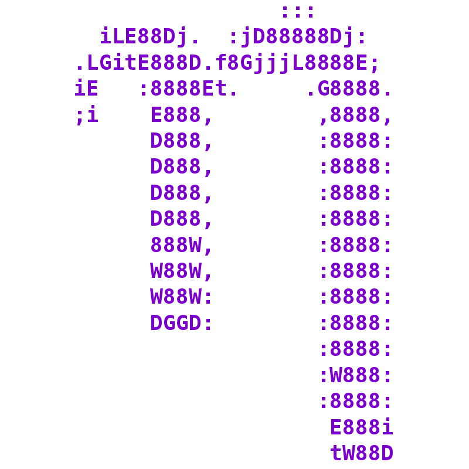

В мире Linux-UNIX используется множество текстовых редакторов.  Классический **vi**, который можно найти практически на любой операционной системе UNIX. Именно поэтому умение редактировать даже незначительный текстовый файл в **vi** является обяза­тельным требованием для администратора Linux. Если однажды вам придется вос­станавливать онлайн-подключение в незнакомой среде, **vi** может оказаться прило­жением, которое всегда будет под рукой (хотя на мой взгляд он не самый удобный).  
Редактор **vim** представляет собой более современный, с большим количеством  
функций и дружественный пользователю редактор **vi**. В Linux существует много других команд и приложений GUI для редактирование текста. Среди консольных редакторов, которые могут вам показаться проще в обращении, чем **vi** или **vim**, можно выделить и **nano**. Запустите любой из этих редакторов, указав в командной строке его название, при желании дополнив его в конце именем файла, который хотите отредактировать

