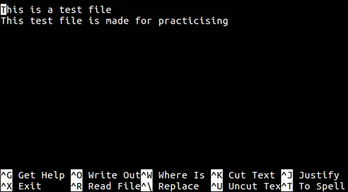

Редактор nano (представленный командой nano) является компактным тексто­вым редактором, который запускается из командной консоли.  
Редактор nano не требует выполнения специ­альных команд для начала редактирования - открыв документ, вы можете сразу начинать печатать. Чтобы открыть текстовый файл для редактирования, просто введите команду nano и имя файла или воспользуйтесь одним из следующих пара­метров:  
**$ nano memo.txt** Открывает файл memo.txt для редактирования  
**$ nano -В memo.txt** При сохранении осуществляет резервное копирование предыдущего варианта файла  
**$ nano -m memo.txt** Включает управление курсором с помощью мыши (если это поддерживается )  
**$ nano +83 memo.txt** Начинает редактирование со строки 83  
Параметр - m командной строки активизирует поддержку мыши, которая может быть использована для выбора позиции курсора в тексте. Следует помнить, что, если дважды щелкнуть кнопкой мыши на тексте, будет выделен целый его блок.

Чтобы перемешать курсор влево, вправо, вверх или вниз, используйте клавиши со стрелками. Используйте клавишу Delete для удаления выделенного текста под курсором или Backspace для удаления текста слева от курсора. Для переноса стро­ки нажмите клавишу Enter. Для вызова справки используйте сочетание клавиш Ctrl+G. Внизу (под текстом) имеется подсказка по комбинациям клавиш для управления редактором. Символ ^ означает здесь клавишу <Ctrl> — т. е., для выхода из редактора нужно нажать комбинацию клавиш <Ctrl>+<X>, а для сохранения текста — <Ctrl>+<O>.

