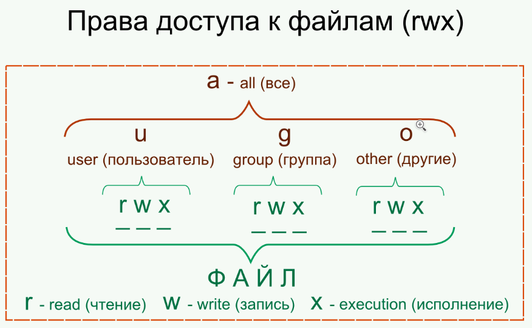

Для каждого каталога и файла вы можете задать права доступа. Точнее, права доступа автоматически задаются при создании каталога/файла, а вам при необходимости можно их изменить. Какая может быть необходимость? Например, вам нужно чтобы к вашему файлу-отчету смогли получить доступ пользователи — члены вашей группы. Или вы создали обычный текстовый файл, содержащий инструкции командного интерпретатора. Чтобы этот файл стал сценарием, вам нужно установить право на выполнение для этого файла.  
Существуют три права доступа: чтение (**r**), запись (**w**), выполнение (**х**). Для каталога право на выполнение означает право на просмотр содержимого каталога. Вы можете установить разные права доступа для владельца (т. е. для себя), для группы владельца (т. е. для всех пользователей, входящих в одну с владельцем группу) и для прочих пользователей. Пользователь root может получить доступ к любому файлу или каталогу вне зависимости от прав, которые вы установили.

  
Чтобы просмотреть текущие права доступа, введите команду:  
`ls -l <имя файла/каталога>`

Например,  
`ls -l video.txt`  
В ответ программа выведет следующую строку:  
-r--r----- 1 serge group 300 Apr 1111:11 video.txt  
В этой строке фрагмент: -r--r----- описывает права доступа:

1. Первый символ — это признак каталога. Сейчас перед нами файл. Если бы перед нами был каталог, то первый символ был бы символом d (от directory);
2. Последующие три символа (r--) определяют права доступа владельца файла или каталога. Первый символ — это чтение, второй — запись, третий — выполнение. Как можно видеть, владельцу разрешено только чтение этого файла, запись и выполнение запрещены, поскольку в правах доступа режимы w и х не определены;
3. Следующие три символа (r--) задают права доступа для членов группы владель­ца. Права такие же, как и у владельца: можно читать файл, но нельзя изменять или запускать;
4. Последние три символа (---) задают права доступа для прочих пользователей.

Прочие пользователи не имеют права ни читать, ни изменять, ни выполнять файл. При попытке получить доступ к файлу они увидят сообщение **Access denied**.  
Как можно видеть, после символов прав доступа команда ls выводит имя владельца файла, имя группы владельца, размер файла, дату и время создания, а также имя файла.

