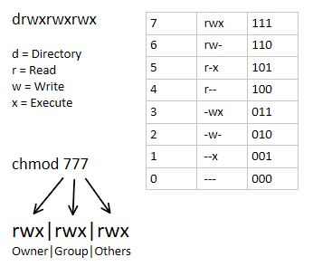

Права доступа задаются командой chmod. Существуют два способа указания прав доступа: символьный (когда указываются символы, задающие право доступа, — r, w, х) и абсолютный.  
Так уж заведено, что в мире UNIX чаще пользуются абсолютным методом. Разберемся, в чем он заключается, и рассмотрим следующий набор прав доступа:  
**rw-r--**  
Этот набор предоставляет владельцу право чтения и модификации файла (rw-), запускать файл владелец не может. Члены группы владельца могут только просматривать файл (r--), а все остальные пользователи не имеют вообще никакого доступа к файлу.  
Возьмем отдельный набор прав, например, для владельца: rw-.  
Чтение разрешено — мысленно записываем 1, запись разрешена— запоминаем еще 1, а вот выполнение запрещено, поэтому запоминаем 0. Получается число 110. Если из двоичной системы перевести число ПО в восьмеричную, получится число 6. Для перевода можно воспользоваться таблицей. Аналогично произведем разбор прав для членов группы владельца. Получится двоичное 100, т.е. восьмеричное 4. С третьим набором (---) все вообще просто — это 000.  
Преобразование чисел из двоичной системы в восьмеричную

|  |  |
| --- | --- |
| Двоичная система  | Восьмеричная система |
| 000 | 0 |
| 100 | 4 |
| 001 | 1 |
| 101 | 5 |
| 010 | 2 |
| 110 | 6 |
| 011 | 3 |
| 111 | 7 |

 

Записываем полученные числа в восьмеричной системе в порядке владелец-группа-остальные. Получится число 640 — это и есть права доступа. Для того чтобы установить эти права доступа, выполните команду:  
chmod 640 <имя\_файла>  
Наиболее популярные права доступа:

* 644 — владельцу можно читать и изменять файл, остальным пользователям —  
только читать;
* 666 — читать и изменять файл можно всем пользователям;
* 777 — всем можно читать, изменять и выполнять файл.

Для каталога право выполнения — это право просмотра оглавления каталога.  
Иногда символьный метод оказывается проще. Например, чтобы файл script сделать исполнимым, можно отдать команду:  
`chmod +х script`  
Для того чтобы снять право выполнения, указывается параметр -х:  
`chmod -х script`  
Подробнее о символьном методе вы сможете прочитать в руководстве по команде chmod (выполнив команду man chmod).

Если вы хотите «подарить» кому-то файл, т. е. сделать какого-либо пользователя владельцем файла, вам нужно использовать команду chown:  
`chown пользователь файл`  
**Осторожно**! Возможно, что после изменения владельца файла вы сами не сможете получить к не­му доступ, ведь владельцем будете уже не вы.

