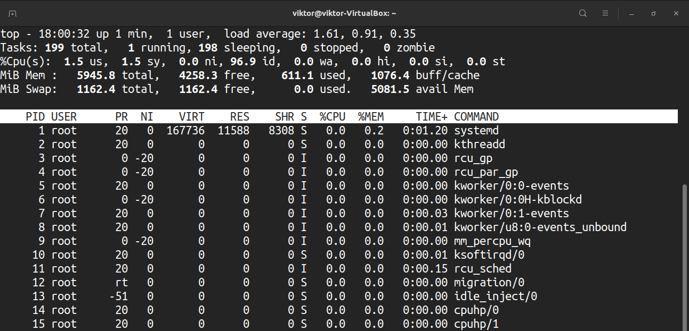

Чтобы посмотреть, насколько система загружена в данный момент времени, используют консольную команду top.

Команда top в Linux системах позволяет вывести в виде таблицы перечень запущенных процессов и оценить, какой объем ресурсов они потребляют, т.е., какую нагрузку создают на сервер и дисковую подсистему. Такая информация помогает в дальнейшем оптимизировать работу системы.

Введите в консоли **top** — Enter и вы увидите таблицу, в которой выведен список запущенных процессов. Изначально перечень составлен в порядке убывания нагрузки, приходящейся на процессор.

О том, как сортировать данные по критерию, который нужен вам, поговорим дальше. А сейчас давайте рассмотрим, как расшифровать столбцы в таблице и о чем свидетельствуют значения в каждом из них.

Первые два столбика — номер процесса (PID) и имя пользователя, его запустившего (USER).

Следующие 2 столбца показывают, какой приоритет имеет процесс в данный момент (PR) и приоритет, присвоенный ему командой NICE (NI).

Информация, содержащаяся в других колонках, характеризует непосредственно уровень потребления ресурсов. Расшифровываются они следующим образом:

\*\*VIRT — виртуальная память, которую использует процесс  
\*\*RES — физическая память, занятая данным процессом  
\*\*SHR — общий объем памяти, которую данный процесс делит с другими  
\*\*S — текущий статус процесса: R — running; S — sleeping, Z — zombie  
\*\*%CPU — процент используемого времени центрального процессора  
\*\*%MEM — процент ОЗУ, используемой процессом  
\*\*TIME+ — продолжительность работы процесса с момента запуска  
\*\*COMMAND — название команды (программы), которая инициировала процесс.

Расшифровка данных перед таблицей  
Полезная информация об использовании ресурсов содержится не только в самой таблице, но и в пяти строках, которые ей предшествуют. Они являются своего рода summary по всем процессам.

Первая строчка (**top**) дает нам общее представление о загрузке системы. Здесь указано:

\*\* текущее время  
\*\* up — продолжительность работы системы с момента запуска  
\*\* user — текущее количество пользователей системы  
\*\* load average — средняя загруженность системы одну минуту назад, пять и 15 соответственно.

Считается, что в норме данный показатель не должен превышать 1 для одноядерных процессоров. Соответственно, значение load average, равное количеству ядер, является предельным.

Вторая строка данных дает информацию об общем количестве процессов в системе, а также об их статусе: выполняемые (running), в ожидании (sleeping), приостановленные (stopped), zombie.

Далее идет информация о состоянии процессора (%Cpu), ОЗУ (Mem), SWAP.

Добавление столбцов и сортировка таблицы top  
Теперь вы знаете, какая информация зашифрована в каждом столбце таблицы top. Как было отмечено в начале, базовая сортировка данных осуществляется по уровню использования времени ЦПУ, оно же %CPU. Чтобы выполнить в top сортировку по памяти (%MEM), достаточно ввести Shift+M в режиме работы команды top. Если интересует, какой из процессов дольше всего работает, нажмите Shift+T, и увидите интересующую информацию в колонке TIME+. Можно отсортировать процессы по их номеру (PID), набрав на клавиатуре Shift+N.

Чтобы вернуться к режиму сортировки по уровню потребления ресурсов процессора, воспользуйтесь комбинацией **Shift+P**.

Далеко не все способы сортировки можно задать с помощью «горячих клавиш». Например, для определения процессов, которые больше всего потребляют SWAP, используйте меню выбора полей, которое вызывается комбинацией **Shift+F**.

С помощью клавиш навигации находим SWAP (или любой другой нужный параметр), клавишей «d» закрепляем его добавление в общую таблицу команды top (в качестве подтверждения вашего выбора рядом появится символ «\*»). Чтобы задать сортировку по SWAP, здесь же нажимаем «s» и выходим из меню (ESC). Готово!

Теперь вы не только знаете, как расшифровать содержащуюся в таблице информацию, но и умеете добавлять в нее необходимые параметры, работать с фильтрами. Благодаря команде top вы легко найдете процессы, которые потребляют наибольшее количество ресурсов и/или работают без надобности.

