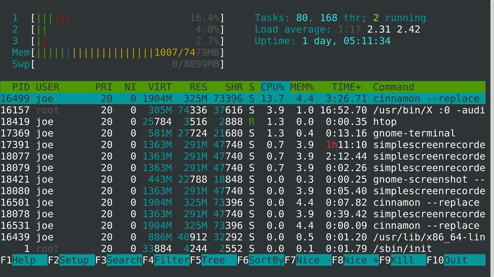

**htop** — продвинутый монитор процессов, написанный для Linux. Он был задуман заменить стандартную программу top. Htop показывает динамический список системных процессов, список обычно выравнивается по использованию ЦПУ. В отличие от top, htop показывает все процессы в системе. Также показывает время непрерывной работы, использование процессоров и памяти. Htop часто применяется в тех случаях, когда информации даваемой утилитой top недостаточно, например при поиске утечек памяти в процессах.

Столбцы:  
PID - идентификатор процесса.  
USER - владелец процесса.  
PRI - текуший приоритет (влияет на процессорное время, отводимое процессу, значение по умолчанию - 20; чем меньше приоритет, тем больше времени отводится процессу, следовательно он выполняется быстрее).  
NI - величина изменения приоритета относительно значения PRI (клавиши F7, F8).  
VIRT - общий объем виртуальной памяти, используемой процессом. Включает в себя: область кода (CODE), данные (DATA), разделяемые библиотеки (SHARED) и страницы, перемещенные в swap-область памяти. Если приложение потребовало от ядра выделить ему 100Мб памяти, а использует всего 5 Мб, данный столбец всё равно будет показывать цифру 100.  
(CODE - объем памяти, содержащий исполняемый код процесса.  
DATA - объем памяти, занятой данными, используемыми процессом в ходе выполнения.  
SWAP - объем памяти, используемой процессом, но перемещенной в swap-область.)  
RES - количество резидентной (не перемещаемой в swap) памяти в килобайтах. Если приложение потребовало от ядра выделить ему 100Мб памяти, а использует всего 5 Мб, то данный столбец покажет 5. Но здесь есть два ньюанса:

* RES не показывает сколько данных было перемещено в swap,
* часть RES-памяти может быть разделяемой.

SHR - количество разделяемой (shared) памяти программы в килобайтах, т.е. памяти, которая может быть использована другими приложениями.

S - состояние процесса:  
S — так называемое состояние сна;  
R — состояние выполнения;  
D — состояние ожидания.

CPU% - использование процессора в процентном отношении.

MEM% - использование процессом памяти в процентном отношении.

TIME+ - время работы процесса.

Command - указывает на команду, которой был запущен процесс.

Через настройки (F2) можно добавить еще некоторые полезные параметры:

IO RATE - Операции ввода\вывода. Чтение + запись. Если нужно отдельно на чтение и на запись, то можно добавить:

IO READ RATE и IO WRITE RATE.

Также на экран выводятся следующие параметры:

Load average - отражает число блокирующих процессов в очереди на исполнение в определенный временной интервал, а именно 1 минута, 5 минут и 15 минут, соответственно. Блокирующий процесс — это процесс, который ожидает ресурсов для продолжения работы.

Uptime - время работы системы.

  
Управление:

**F1** - справка;  
**F2** - настройки;  
**F3** - поиск процесса;  
**F4** - сортировка списка процессов (от большего к меньшему или от меньшего к большему);  
**F5** - устанавливает древовидное отображение (корни - родительские процессы, а листья - дочерние) и наоборот;  
**F6** - открывает панель с выбором параметра сортировки процессов;  
**F7** - увеличить приоритет выполнения текущего процесса;  
**F8** - уменьшить приоритет выполнения текущего процесса;  
**F9** - убить процесс;  
**F10** - выйти из программы.

