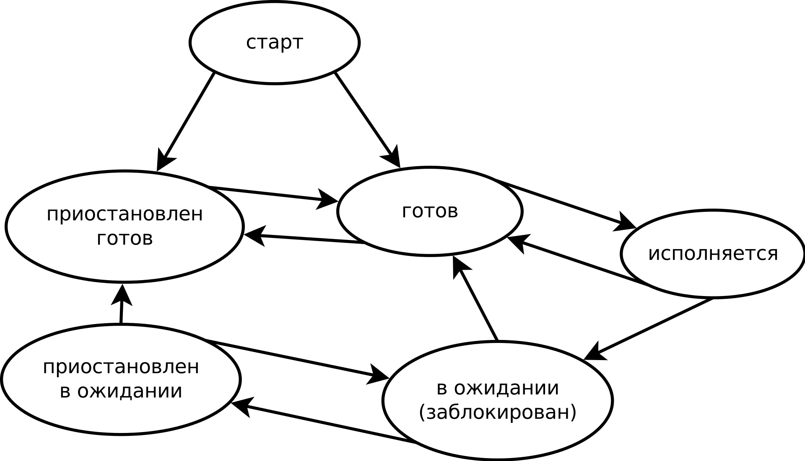

Процессы операционной системы в большинстве случаев отождествляются с выполняющимися программами, что не совсем верно, точнее — совсем не верно.  
В современных операционных системах, включая Linux, между программой и про­цессом есть очевидная взаимосвязь, но далеко не такая непосредственная, как кажется на первый взгляд.  
Сущность процесса неразрывно связана с мультипрограммированием и многозадач­ностью операционной системы. Например, в однозадачных операционных системах программы существуют, а процессы — нет. В однозадачных операционных систе­мах единовременно одна последовательная программа выполняется одним исполни­телем (центральным процессором), имея возможность безраздельно использовать все доступные ресурсы (память, устройства ввода-вывода и пр.). В любой программе можно выделить перемежающиеся блоки инструкций, использующих или центральный процессор (ЦП), или устройства ввода-вывода (УВВ). При этом центральный процессор вынужден простаивать при выполнении програм­мой операций ввода-вывода, например, при ожидании окончания записи (или чте­ния) блока данных на внешний носитель, или при ожидании окончания передачи или приема) сетевого кадра, или при ожидании событий с устройств человеко-машинного взаимодействия. С другой стороны, устройства ввода-вывода тоже вынуждены простаивать при выполнении программой вычислительных операций, например ожидая результата, подлежащего выводу, или ожидая возникновения программы потребности в новых исходных данных. Используя такую модель поведения программ, можно провести анализ потребления ими ресурсов при выполнении. Например, компрессоры **gzip**, **bzip** и **xz** считы­вают очередной блок данных исходного файла, относительно долго упаковывают его и записывают в результирующий файл, а затем повторяют процедуру до исxерпания блоков исходного файла. Количество времени, потраченного на вычисли­тельные операции упаковки, будет много больше количества времени, потраченного на чтение исходных данных и запись результатов, поэтому нагрузка на ЦП будет высокой, а на УВВ — нет. Такой же анализ можно привести и для дубликатора dd, копировщика rsync или архиватора tar, которые, наоборот, почти не вы­  
полняют никаких вычислений, а сосредоточены на вводе-выводе больших объемов данных, поэтому при их использовании нагрузка на ЦП будет довольно низкой, а на УВВ — высокой.  
Для командного интерпретатора bash, текстовых редакторов nаnо и vim и других интерактивных программ, взаимодействующих с пользователем, характер­ны длительные ожидания ввода небольших команд, простая и недолгая их обра­ботка и вывод короткого результата. В результате коэффициент полезного исполь­зования и ЦП, и УВВ будет приближен к нулю.  
Подобный анализ и желание увеличить коэффициенты полезного использования ресурсов привели к созданию многозадачных операционных систем, основываю­щихся на простой идее псевдоодновременного выполнения нескольких последова­тельных программ одним исполнителем. Для этого вместо простоя в ожидании окончания операции ввода-вывода, начатой некоторой программой, центральный  
процессор переключается на выполнение другой программы, тем самым увеличивая интегральный коэффициент его полезного использования.

  
С появлением мультипрограммной смеси (Набор программ, между которыми переключается процессор) каждая из ее программ больше не мо­жет безраздельно использовать все доступные ресурсы (например, всю память — она одновременно нужна всем программам смеси), в связи с чем операционная система берет на себя задачи диспетчеризации (распределения) ресурсов между ними. В Linux, как и во многих других операционных системах, программы изоли­руются друг от друга в специальных «виртуальных» средах, обеспечивающих их процесс выполнения. Каждая такая среда называется процессом и получает долю доступных ресурсов — выделенный участок памяти, выделенные промежутки про­цессорного времени. Процесс эмулирует для программы «однозадачный» режим выполнения, словно программа выполняется в одиночку, и «безраздельное» исполь­зование ресурсов процесса, как будто это все доступные ресурсы. Компьютерная программа сама по себе — лишь пассивная последовательность инструкций. В то время как процесс — непосредственное выполнение этих инструкций.  
Параллельные программы, как указывалось ранее, состоят из независимых ветвей, каждая из которых сама по себе укладывается в модель поведения последователь­ной программы, поэтому одну параллельную программу можно выполнять в не­скольких процессах в псевдоодновременном режиме. Процессы операционной сис­темы, таким образом, являются контейнерами для многозадачного выполнения про­грамм, как последовательных, так и параллельных.

