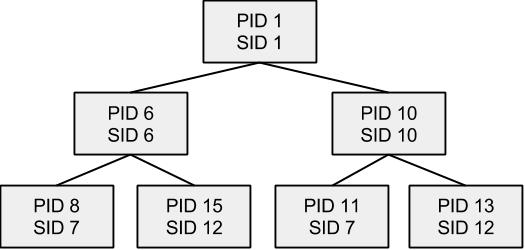

Ядро Linux — основа любого дистрибутива. Оно управляет памятью, позволяет программам получать доступ к жесткому диску, распределяет процессорное время и занимается другими низкоуровневыми задачами. Ядро загружается на раннем этапе загрузки системы и отвечает за управление всеми остальными экземплярами программного обеспечения на компьютере.  
Один из способов, с помощью которых ядро может навести порядок в потенциально хаотичном наборе программного обеспечения, — установление иерархии. При загрузке ядро выполняет всего одну программу —обычно это /sbin/init. Процесс init отвечает за запуск всех основных задач в Linux, таких как управление входом  
в систему и постоянно работающие серверы. Программы такого рода, если они запущены напрямую из програм­  
мы in it, называются потомками (дочерними). Потомок программы init, в свою очередь, может запускать собственные дочерние программы. Это происходит, когда вы входите в систему. Процесс, который запускает какой-то другой процесс, называется родителем.  
Результатом является древовидная иерархия процессов. Некоторые из них , например, связаны с текстовым входом в систему, включая утилиту login, которая именно этим и занимается. В реальной системе Linux число работающих  
процессов может достигать десятков, а то и сотен.  
У каждого процесса — свой идентификационный номер (Process ID, или PID). Номера начинаются с еди­ницы, поэтому PID программы init обычно равен 1.

  
Каждый процесс также обладает идентификатором сво­его родителя (Parent Process ID, или PPID). Эти номера  
активно используются в инструментах для управления процессами, особенно это касается PID.

