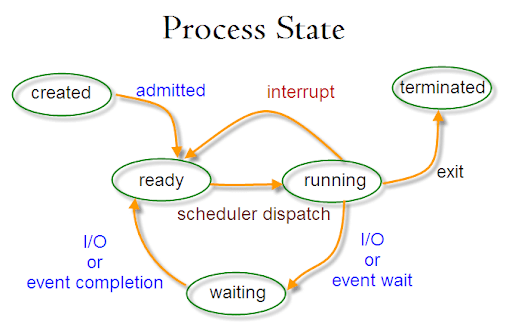

**Рождение процесса**  
Только один процесс в системе рождается особенным способом — init — он порождается непосредственно ядром. Все остальные процессы появляются путём дублирования текущего процесса с помощью системного вызова fork. После выполнения fork(2) получаем два практически идентичных процесса за исключением следующих пунктов:

1. fork(2) возвращает родителю PID дочернего, дочернему возвращается 0;
2. У дочернего меняется PPID (Parent Process Id) на PID родителя.

**Состояние «готов»**  
Сразу после выполнения fork переходит в состояние «готов».  
Фактически, процесс стоит в очереди и ждёт, когда планировщик (scheduler) в ядре даст процессу выполняться на процессоре.

**Состояние «выполняется»**  
Как только планировщик поставил процесс на выполнение, началось состояние «выполняется». Процесс может выполняться весь предложенный промежуток (квант) времени, а может уступить место другим процессам, воспользовавшись системным вывозом.

**Перерождение в другую программу**  
если нужно запустить другую программу, то процессу необходимо прибегнуть к системному вызову exec\*

**Состояние «ожидает»**  
Некоторые системные вызовы могут выполняться долго, например, ввод-вывод. В таких случаях процесс переходит в состояние «ожидает». Как только системный вызов будет выполнен, ядро переведёт процесс в состояние «готов».Как только системный вызов будет выполнен, ядро переведёт процесс в состояние «готов». В Linux так же существует состояние «ожидает», в котором процесс не реагирует на сигналы прерывания. В этом состоянии процесс становится «неубиваемым», а все пришедшие сигналы встают в очередь до тех пор, пока процесс не выйдет из этого состояния.  
Ядро само выбирает, в какое из состояний перевести процесс. Чаще всего в состояние «ожидает (без прерываний)» попадают процессы, которые запрашивают ввод-вывод. Особенно заметно это при использовании удалённого диска (NFS) с не очень быстрым интернетом.

**Состояние «остановлен»**  
В любой момент можно приостановить выполнение процесса, отправив ему сигнал остановки. Процесс перейдёт в состояние «остановлен» и будет находиться там до тех пор, пока ему не придёт сигнал продолжать работу или умереть. Остальные сигналы будут поставлены в очередь.

**Завершение процесса**  
Ни одна программа не умеет завершаться сама. Они могут лишь попросить систему об этом с помощью системного вызова \_exit или быть завершенными системой из-за ошибки. Даже когда возвращаешь число из main(), всё равно неявно вызывается \_exit.

**Состояние «зомби»**  
Сразу после того, как процесс завершился (неважно, корректно или нет), ядро записывает информацию о том, как завершился процесс и переводит его в состояние «зомби». Иными словами, зомби — это завершившийся процесс, но память о нём всё ещё хранится в ядре.

**Забытье**  
Код возврата и причина завершения процесса всё ещё хранится в ядре и её нужно оттуда забрать. Для этого можно воспользоваться соответствующими системными вызовами wait или waitpid  
Вся информация о завершении процесса влезает в тип данных int

