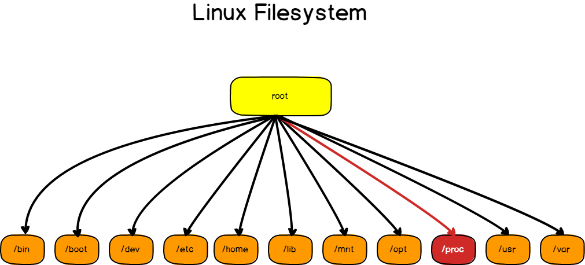

Cпециальная файловая система, используемая в UNIX-подобных операционных системах. Позволяет получить доступ к информации из ядра о системных процессах.  
На самом деле папка proc - это совсем необычная папка. Ее не существует на диске или даже в оперативной памяти, как это делается в /tmp. Все поддиректории, файлы и хранящаяся в них информация генерируется ядром на лету, как только вы ее запрашиваете. Но работает все настолько прозрачно, что вы не заметите никакой разницы между обычной файловой системой и proc, если откроете ее с помощью файлового менеджера.

Только папка proc linux содержит файлы нулевого размера. А также у каждого файла будет текущая дата создания. Например файл /proc/meminfo будет содержать разные данные при каждом открытии, поскольку использование памяти постоянно колеблется.

С помощью такой системы разработчики придерживаются главной концепции Unix - все есть файл. Все файлы доступны для редактирования любым редактором, и все они в простом текстовом формате, но для того чтобы проанализировать весь каталог вам понадобятся права суперпользователя. Почти все файлы доступны только для чтения, с них мы можем только получать информацию. Но есть и доступные для записи, в частности это /proc/sys с помощью которого вы можете настраивать различные параметры ядра.

