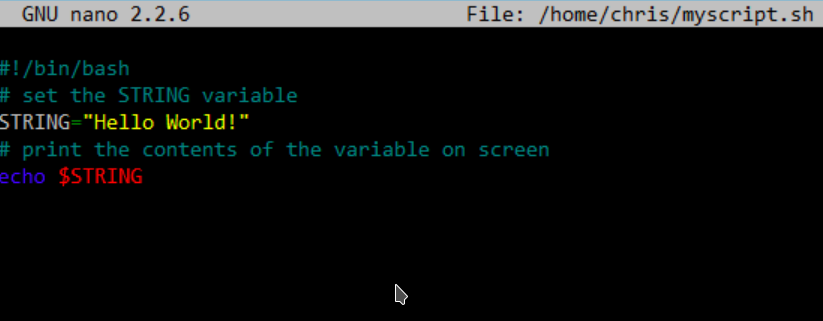

Изначально в операционных системах Unix и Linux не было графического интерфейса, поэтому программы запускались командами из терминала. С появление GUI этот способ продолжает существовать. Синтаксис запуска программы выглядит таким образом:

**/путь/к/файлу/программы параметры**

Параметры указываются только, когда они нужны, но всегда оболочка должна знать полный путь к программе. Все что после имени программы и пробела - это параметры. Вы, наверное, уже заметили, что обычно мы не указываем полный путь при выполнении программ. Это было бы очень долго и неудобно.  
Чтобы решить проблему Была создана переменная PATH, в которой хранятся все пути к папкам где обычно находятся программы - /bin, /sbin, /usr/bin, /usr/sbin и так далее. Вы можете посмотреть ее содержимое командой:  
`echo $PATH`

Программы делятся на бинарные и интерпретируемые. Раньше мы говорили только про бинарные программы. Для запуска интерпретируемых нужен непосредственно интерпретатор, к таким программам относятся написанные на таких языках, как  Python, Bash, Perl, Ruby, PHP и многих других. Синтаксис запуска такой программы отличается:  
`интерпретатор /путь/к/файлу/программы параметры`  
Таким образом вы можете запускать например bash скрипты.

Поговорим о bash-скриптах. Это — сценарии командной строки, написанные для оболочки bash. Сценарии командной строки — это наборы тех же самых команд, которые можно вводить с клавиатуры, собранные в файлы и объединённые некоей общей целью. При этом результаты работы команд могут представлять либо самостоятельную ценность, либо служить входными данными для других команд. Сценарии — это мощный способ автоматизации часто выполняемых действий.

Попробуем написать свой первый скрипт, который будет выводить строку "Current directory is:", а с новой строчки выводить полный путь до текущей директории. Создадим файл first.sh, напишем в нем и сохраним:  
`echo "Current directory is:"`  
`pwd`  
Зайдем в терминал и напишем bash first.sh. Видим что последовательность команд выполнилась

