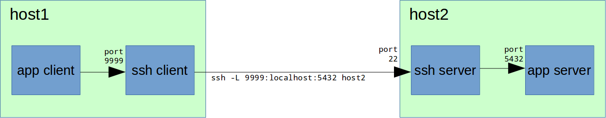
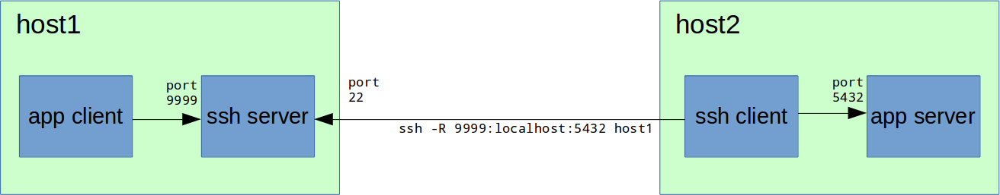

**Local TCP forwarding**

Имеем удаленный сервер «host2» с неким приложением, допустим, PostgreSQL server, которое принимает TCP-соединения на порту 5432. При этом вполне логично, что на этом сервере стоит файрвол, который прямых соединений извне на порт 5432 не разрешает, но при этом есть доступ по SSH (по-умолчанию порт 22, рекомендую его изменить). Требуется подключиться с нашего рабочего места «host1» клиентским приложением к серверу PostgreSQL на «host2».

Для этого на «host1» в консоли набираем:

`host1# ssh -L 9999:localhost:5432 host2`  

Теперь на «host1» мы можем соединяться с PostgreSQL сервером через локальный порт 9999:

`host1# psql -h localhost -p 9999 -U postgres`  
После успешного подключения к SSH-серверу на «host2», на «host1» SSH-клиент начинает слушать порт 9999. При подключении к порту 9999 на «host1», SSH-сервер на «host2» устанавливает соединение с localhost (коим и является для себя самого «host2») на порт 5432 и передает по этому соединению данные, принятые ssh-клиентом на «host1» на порт 9999.  
ВАЖНО! Все указанные на схемах стрелками соединения являются отдельными TCP-соединениями (сессиями).

  
**Remote TCP forwarding**  
Но что делать, если, например, «host2» не имеет белого IP-адреса, находится за NAT или вообще все входящие соединения к нему закрыты? Или, например, на «host2» стоит Windows и нет возможности поставить SSH-сервер?

Для этого случая есть Remote TCP forwarding:  
Теперь нужно устанавливать ssh-соединение в обратном направлении — от «host2» к «host1». Т.е. наша административная рабочая станция будет SSH-сервером и будет доступна по SSH с «host2», а на «host2» нужно будет выполнить подключение SSH-клиентом:

`ssh -R 9999:localhost:5432 host1`

После успешного подключения, на «host1» SSH-сервер начинает слушать порт 9999. При подключении к порту 9999 на «host1», SSH-клиент на «host2» устанавливает соединение с localhost (коим и является для себя самого «host2») на порт 5432 и передает по этому соединению данные, принятые ssh-сервером на «host1» на порт 9999.

